---
## Author
author:
  name: Просина Ксения Максимовна
  degrees: DSc
  orcid: 0000-0002-0877-7063
  email: 1132231845@pfur.ru
  affiliation:
    - name: Российский университет дружбы народов
      country: Российская Федерация
      postal-code: 117198
      city: Москва
      address: ул. Миклухо-Маклая, д. 6
## Title
title: "Сетевые технологии"
subtitle: "Лабораторная работа №1"
license: CC BY
date: today
date-format: "YYYY-MM-DD" # Example: 2025-09-06
---

# Информация

## Докладчик

:::::::::::::: {.columns align=center}
::: {.column width="70%"}

  * Просина Ксения Максимовна
  * Студент 3 курса
  * факультет физико-математических и естественных наук
  * Российский университет дружбы народов им. П. Лумумбы
  * [1132231938@rudn.ru](1132231938@rudn.ru)

:::
::: {.column width="30%"}

:::
::::::::::::::

# Цель работы

В этой лабораторной работе я изучу методы кодирования и модуляции сигналов с помощью высокоуровнего языка программирования Octave. Определю спектр и параметры сигнала. Продемонстрирую принципы модуляции сигнала на примере аналоговой амплитудной модуляции. Исследую свойство самосинхронизации сигнала.

# Задание

1. Построение графиков сумм гармонических функций в Octave
2. Разложение импульсного сигнала (меандра) в частичный ряд Фурье  
3. Определение спектра и параметров сигнала с использованием быстрого преобразования Фурье (БПФ)
4. Исследование амплитудной модуляции (АМ) сигналов
5. Кодирование сигналов и исследование свойства самосинхронизации

# Выполнение лабораторной работы

## 1.  Построение графиков в Octave

1. Я построю график функции y = sin(x) + (1/3)sin(3x) + (1/5)sin(5x) на интервале [-10; 10]

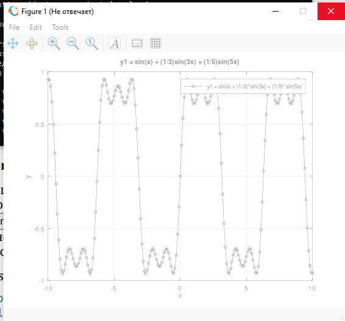{#fig-002 width=70%}

## 1.  Построение графиков в Octave

2. Я создам рабочую среду в Octave и запущу скрипт построения графика

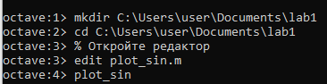{#fig-003 width=70%}

## 2.  Разложение импульсного сигнала (меандра) в ряд Фурье

1. Я реализую код для разложения меандра в ряд Фурье

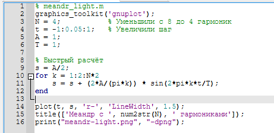{#fig-004 width=70%}

## 2.  Разложение импульсного сигнала (меандра) в ряд Фурье

2. Я получу график меандра, аппроксимированного 4 гармониками

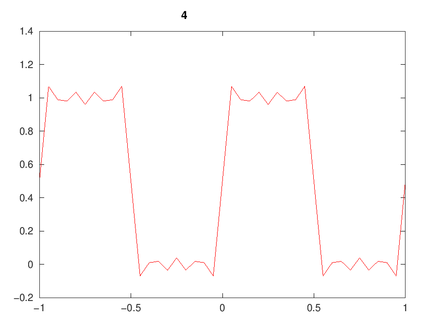{#fig-005 width=70%}

## 3.  Определение спектра и параметров сигнала

1. Я реализую код для анализа спектров сигналов

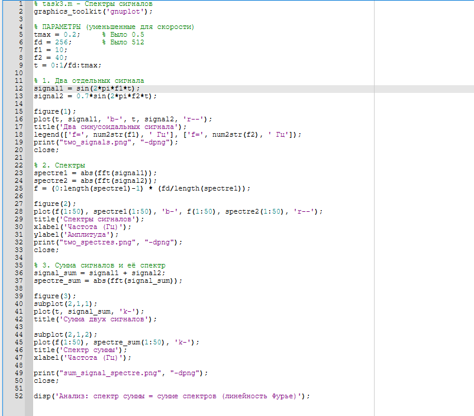{#fig-006 width=70%}

## 3.  Определение спектра и параметров сигнала

2. Я получу графики двух синусоидальных сигналов разной частоты

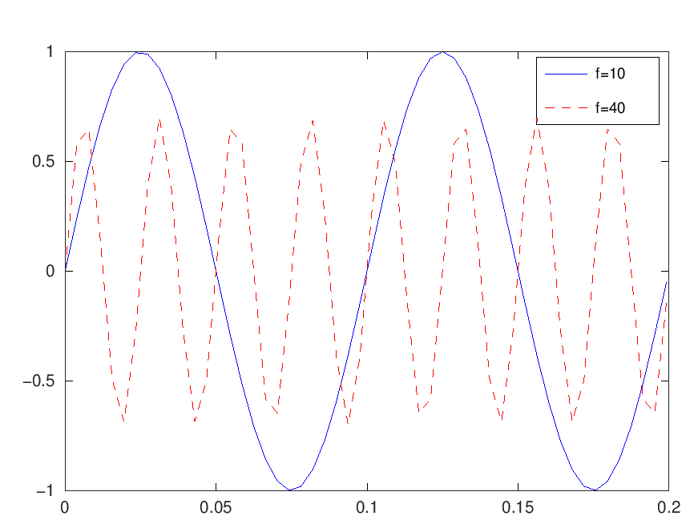{#fig-007 width=70%}

## 3.  Определение спектра и параметров сигнала

3. Я проанализирую спектры сигналов

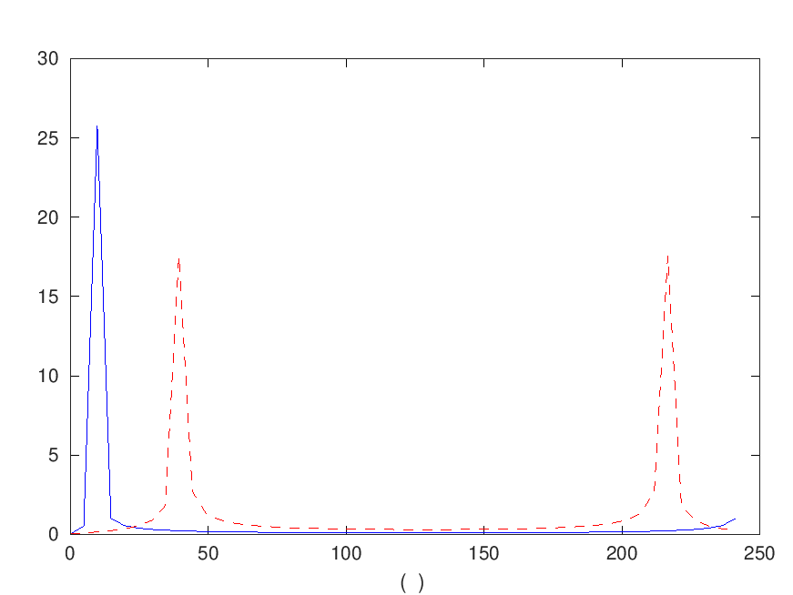{#fig-008 width=70%}

## 3.  Определение спектра и параметров сигнала

4. Я получу суммарный сигнал и его спектр

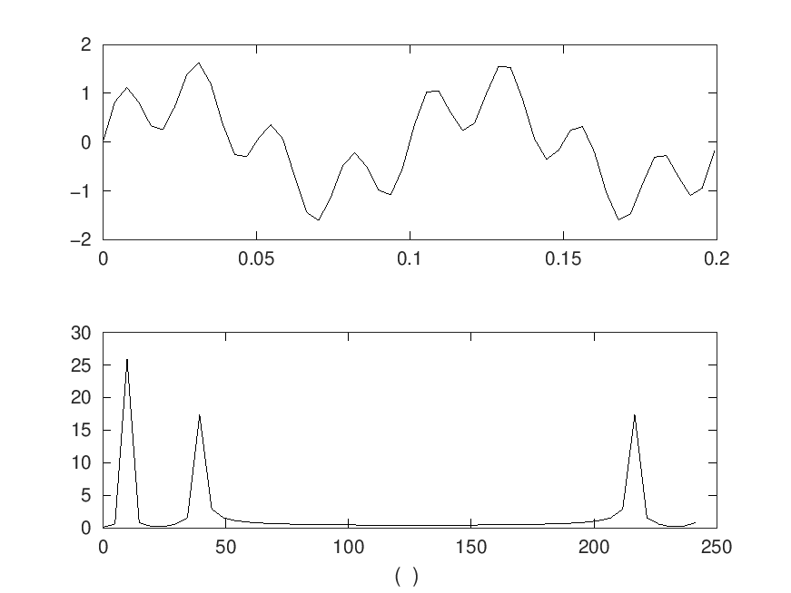{#fig-009 width=70%}

## 4.  Амплитудная модуляция (АМ)

1. Я реализую код для амплитудной модуляции

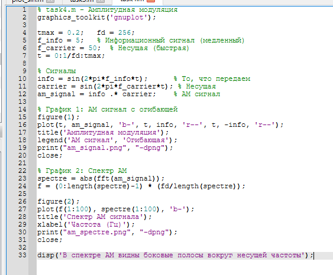{#fig-010 width=70%}

## 4.  Амплитудная модуляция (АМ)

2. Я получу АМ сигнал с огибающей

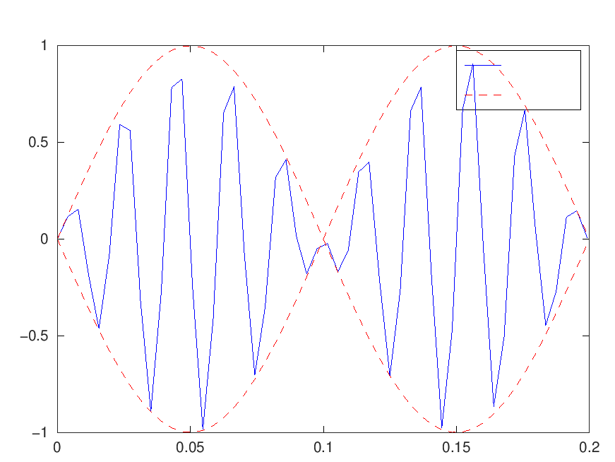{#fig-011 width=70%}

## 5.  Кодирование сигналов и исследование самосинхронизации

1. Я реализую код для методов кодирования

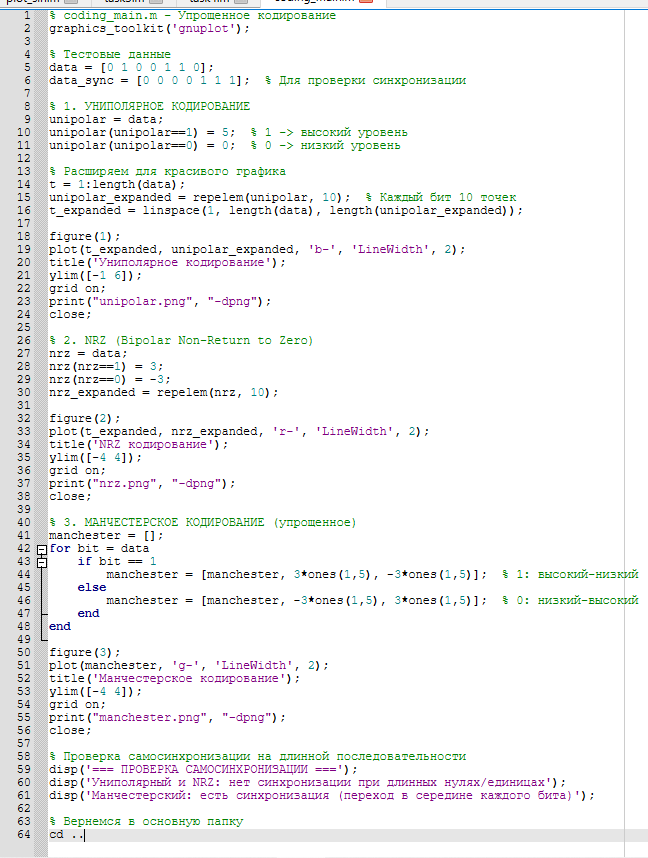{#fig-012 width=70%}

## 5.  Кодирование сигналов и исследование самосинхронизации

2. Я получу график униполярного кодирования

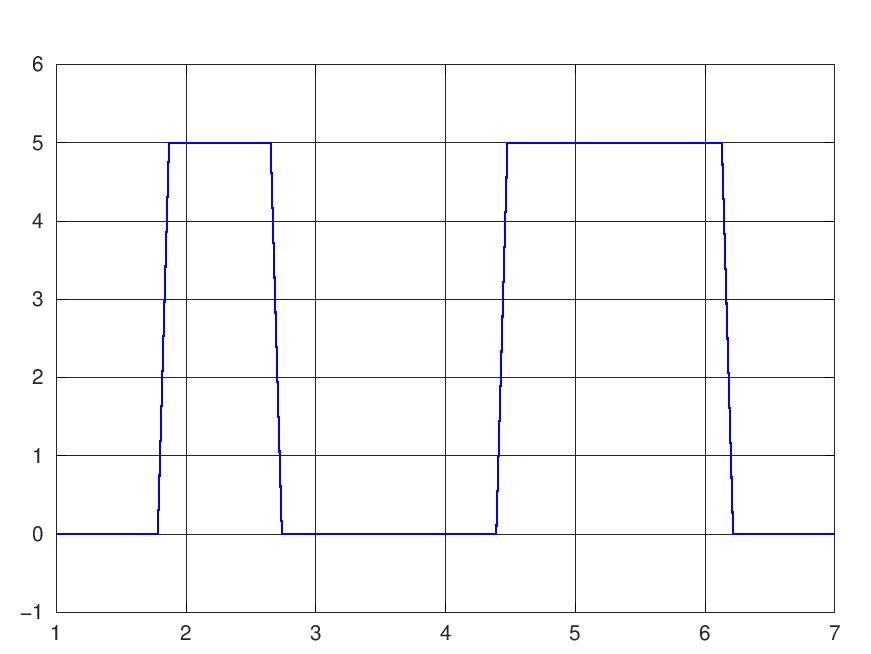{#fig-013 width=70%}

## 5.  Кодирование сигналов и исследование самосинхронизации

3. Я получу график NRZ кодирования

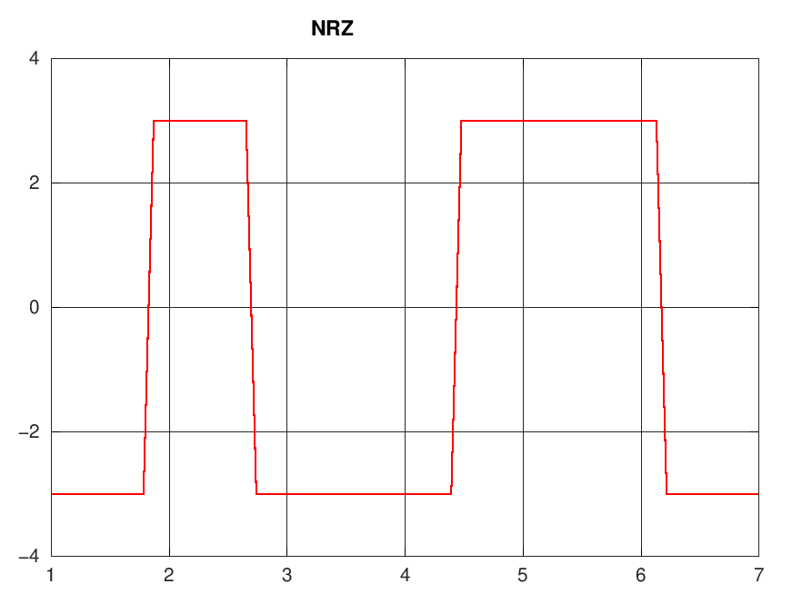{#fig-014 width=70%}

## 5.  Кодирование сигналов и исследование самосинхронизации

4. Я получу график манчестерского кодирования

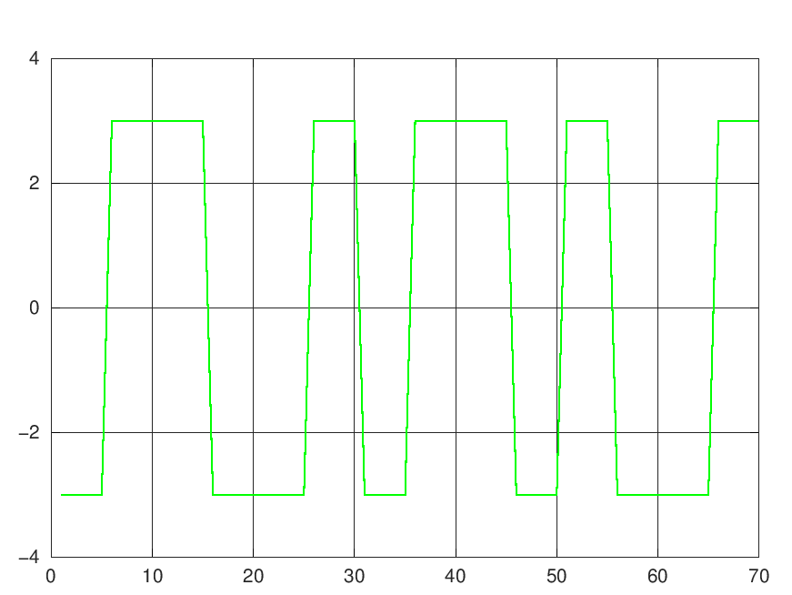{#fig-015 width=70%}

# Выводы

## Выводы

В ходе выполнения лабораторной работы №1 я изучила методы кодирования и модуляции сигналов с помощью высокоуровнего языка программирования Octave. Определила спектр и параметры сигнала. Продемонстрировала принципы модуляции сигнала на примере аналоговой амплитудной модуляции. Исследовала свойство самосинхронизации сигнала.

## Спасибо за внимание!
