---
## Author
author:
  name: Просина Ксения Максимовна
  degrees: DSc
  orcid: 0000-0002-0877-5863
  email: kulyabov-ds@rudn.ru
  affiliation:
    - name: Российский университет дружбы народов
      country: Российская Федерация
      postal-code: 117198
      city: Москва
      address: ул. Миклухо-Маклая, д. 6
## Title
title: Администрирование сетевых подсистем
subtitle: Лабораторная работа №3.
license: CC BY
date: today
date-format: "YYYY-MM-DD" # Example: 2025-09-06
---

# Информация

## Докладчик

:::::::::::::: {.columns align=center}
::: {.column width="58%"}

  * Просина Ксения Максимовна
  * Студент 3 курса
  * факультет физико-математических и естественных наук
  * Российский университет дружбы народов им. П. Лумумбы
  * [1132231938@rudn.ru](1132231938@rudn.ru)

:::
::: {.column width="30%"}

:::
::::::::::::::

## Цель работы

Изучение посредством Wireshark кадров Ethernet, анализ PDU протоколов транспортного и прикладного уровней стека TCP/IP. Приобретение практических навыков захвата, фильтрации и анализа сетевого трафика.

# Задание

## 3.3.1. MAC-адресация

1. Изучение возможностей команды ipconfig для ОС Windows
2. Определение MAC-адресов сетевых интерфейсов
3. Анализ структуры MAC-адресов и определение их типов

## 3.3.2. Анализ кадров канального уровня

1. Установка и настройка Wireshark
2. Захват и анализ ARP и ICMP пакетов
3. Исследование Ethernet кадров

## 3.3.3. Анализ транспортного уровня 

1. Анализ HTTP трафика и TCP протокола
2. Анализ DNS запросов и UDP протокола
3. Анализ современного протокола QUIC

## 3.3.4. Анализ TCP handshake

1. Исследование процесса установления TCP соединения
2. Анализ трехступенчатого рукопожатия
3. Построение графиков потоков

# Теоретические сведения

## Модель OSI и TCP/IP

Сетевые протоколы организованы в виде стека, где каждый уровень выполняет определенные функции:

- **Канальный уровень** (Ethernet, ARP) - работа с MAC-адресами
- **Сетевой уровень** (IP, ICMP) - маршрутизация и диагностика
- **Транспортный уровень** (TCP, UDP) - управление соединениями
- **Прикладной уровень** (HTTP, DNS, QUIC) - взаимодействие приложений

## Структура MAC-адреса

MAC-адрес (Media Access Control) состоит из 6 байтов:
- **Первые 3 байта** - OUI (Organizationally Unique Identifier) - идентификатор производителя
- **Последние 3 байта** - уникальный идентификатор устройства
- **Типы адресов**: индивидуальные (unicast), групповые (multicast), широковещательные (broadcast)

## Трехступенчатый TCP handshake

Процесс установления TCP соединения:
1. **SYN** - клиент отправляет пакет с номером последовательности
2. **SYN-ACK** - сервер подтверждает и отправляет свой номер
3. **ACK** - клиент подтверждает установление соединения

# Выполнение лабораторной работы

## 3.3.1. MAC-адресация

Определение базовых сетевых параметров

С помощью команды `ipconfig` получена общая информация о сетевых подключениях:

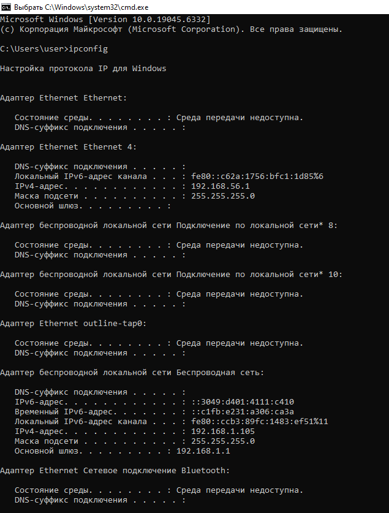{#fig-001 width=80%}

## 3.3.1. MAC-адресация

**Ключевые параметры:**
- Активный интерфейс: Беспроводная сеть
- IPv4-адрес: **192.168.1.105**
- Основной шлюз: **192.168.1.1**
- Маска подсети: **255.255.255.0**

## 3.3.1. MAC-адресация

Детальный анализ сетевых интерфейсов

Команда `ipconfig /all` предоставила полную информацию обо всех сетевых адаптерах:

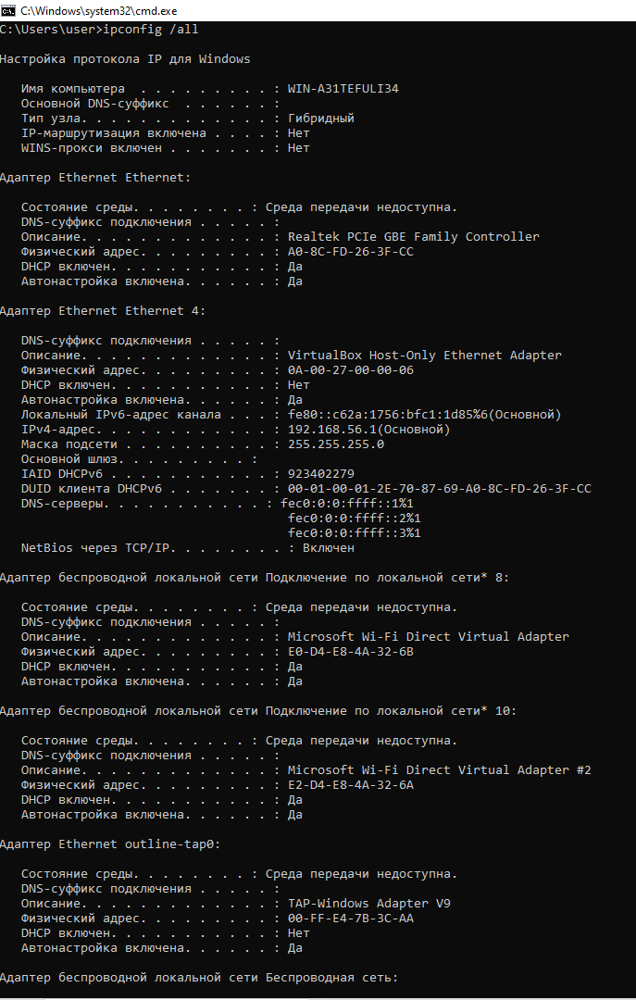{#fig-002 width=80%}

## 3.3.1. MAC-адресация

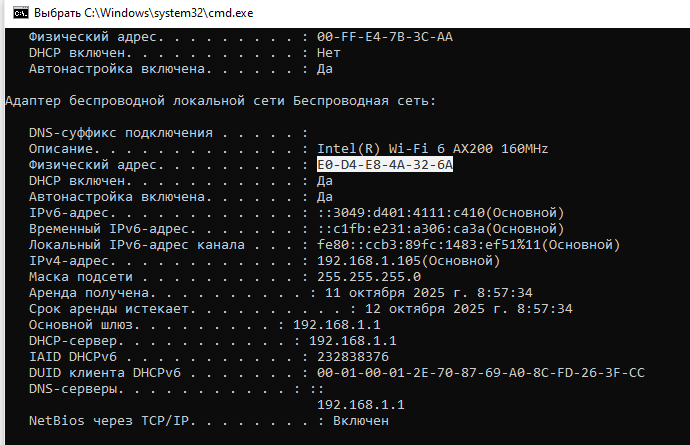{#fig-003 width=80%}

## 3.3.1. MAC-адресация

**Анализ активных сетевых интерфейсов:**

1. **Беспроводной адаптер Intel(R) Wi-Fi 6 AX200:**
   - MAC-адрес: **E0-D4-E8-4A-32-6A**
   - Состояние: активен, получен IP по DHCP
   - Шлюз: 192.168.1.1, DNS: 192.168.1.1

2. **Адаптер VirtualBox Host-Only:**
   - MAC-адрес: **0A-00-27-00-00-06** 
   - IPv4-адрес: 192.168.56.1

3. **Адаптер Realtek PCIe GBE:**
   - MAC-адрес: **A0-8C-FD-26-3F-CC**
   - Состояние: среда передачи недоступна
   
## 3.3.1. MAC-адресация

Структурный анализ MAC-адресов

**Основной MAC-адрес беспроводного адаптера: E0-D4-E8-4A-32-6A**

**Декомпозиция адреса:**
- **OUI (Organizationally Unique Identifier):** E0-D4-E8
  - Производитель: **Intel Corporation**
  - Глобально администрируемый адрес
- **Серийный номер устройства:** 4A-32-6A
  - Уникальный идентификатор сетевого интерфейса
- **Бинарное представление:** 
  - E0 (11100000) - индивидуальный адрес (бит I/G = 0)
  - D4 (11010100) - глобально администрируемый (бит U/L = 0)
  
**Тип адреса:** Индивидуальный (unicast), глобально администрируемый

## 3.3.1. MAC-адресация

 Анализ DNS кэша

Команда `ipconfig /displaydns` показала кэшированные DNS записи:

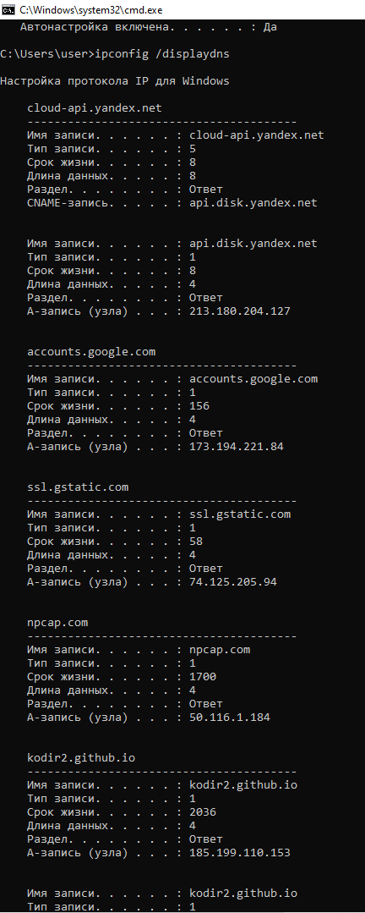{#fig-004 width=80%}

## 3.3.1. MAC-адресация

**Обнаружены DNS записи для:**
- cloud-api.yandex.net → api.disk.yandex.net → 213.180.204.127
- accounts.google.com → 173.194.221.84
- ssl.gstatic.com → 74.125.205.94
- npcap.com → 50.116.1.184

## 3.3.2. Анализ кадров канального уровня в Wireshark

 Захват и анализ ARP трафика

В Wireshark захвачены ARP-пакеты, показывающие процесс разрешения адресов:

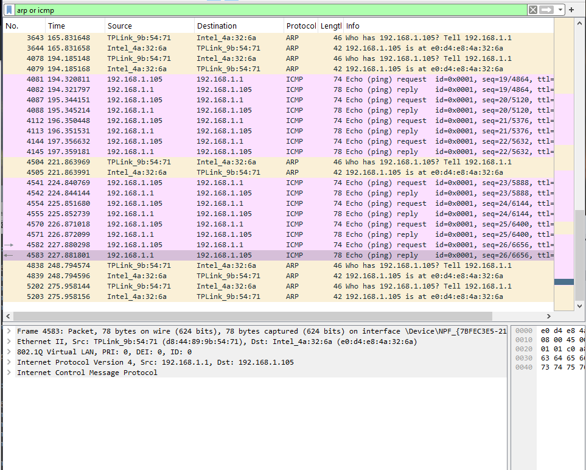{#fig-005 width=90%}

## 3.3.2. Анализ кадров канального уровня в Wireshark

**Детальный анализ ARP пакетов:**

**ARP запрос (пакет 3643):**
- Время: 165.831648
- Отправитель: TPLink_9b:54:71 (D8-44-89-9B-54-71)
- Содержание: "Who has 192.168.1.105? Tell 192.168.1.1"
- Длина: 46 байт
- **Назначение:** широковещательный адрес FF-FF-FF-FF-FF-FF

**ARP ответ (пакет 3644):**
- Время: 165.831658
- Отправитель: Intel_4a:32:6a (E0-D4-E8-4A-32-6A)  
- Содержание: "192.168.1.105 is at E0-D4-E8-4A-32-6A"
- Длина: 42 байта
- **Назначение:** TPLink_9b:54:71 (D8-44-89-9B-54-71)

**Периодичность ARP запросов:** примерно каждые 30 секунд, что соответствует стандартному поведению для обновления ARP таблицы.

## 3.3.2. Анализ кадров канального уровня в Wireshark

Анализ ICMP трафика (ping до шлюза)

Выполнена команда ping до шлюза по умолчанию:

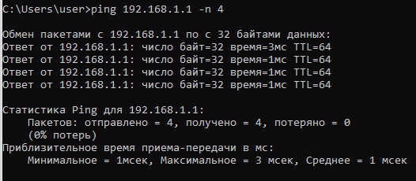{#fig-006 width=80%}

## 3.3.2. Анализ кадров канального уровня в Wireshark

**Результаты ping:**
- Отправлено пакетов: 4
- Получено ответов: 4  
- Потери: 0%
- Время приема-передачи: 1-3 мс

## 3.3.2. Анализ кадров канального уровня в Wireshark

**Анализ ICMP пакетов в Wireshark:**

**ICMP эхо-запрос (пакет 4582):**
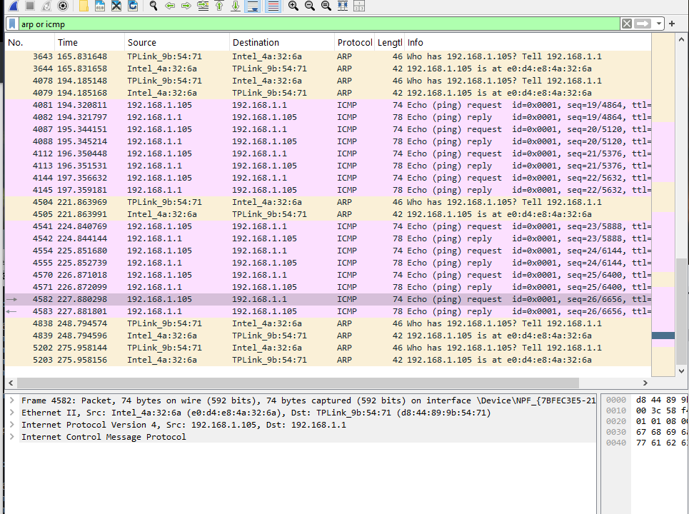{#fig-007 width=90%}

## 3.3.2. Анализ кадров канального уровня в Wireshark

- **Канальный уровень:**
  - Протокол: Ethernet II
  - MAC отправителя: E0-D4-E8-4A-32-6A (Intel)
  - MAC получателя: D8-44-89-9B-54-71 (TP-Link)
  - Длина кадра: 74 байта

- **Сетевой уровень:**
  - Протокол: IPv4
  - IP отправителя: 192.168.1.105
  - IP получателя: 192.168.1.1
  - TTL: 128

- **Транспортный уровень:**
  - Протокол: ICMP
  - Тип: Echo (ping) request
  - ID: 0x0001, Sequence: 26/6656
  
 ## 3.3.2. Анализ кадров канального уровня в Wireshark

**ICMP эхо-ответ (пакет 4583):**
{#fig-008 width=90%}

## 3.3.2. Анализ кадров канального уровня в Wireshark

- **Канальный уровень:**
  - Протокол: Ethernet II с VLAN (802.1Q)
  - MAC отправителя: D8-44-89-9B-54-71 (TP-Link)
  - MAC получателя: E0-D4-E8-4A-32-6A (Intel)
  - Длина кадра: 78 байт
  - VLAN: PRI: 0, DEI: 0, ID: 0

- **Сетевой уровень:**
  - Протокол: IPv4
  - IP отправителя: 192.168.1.1
  - IP получателя: 192.168.1.105
  - TTL: 64

- **Транспортный уровень:**
  - Протокол: ICMP
  - Тип: Echo (ping) reply
  - ID: 0x0001, Sequence: 26/6656
  
## 3.3.2. Анализ кадров канального уровня в Wireshark

 Анализ ping до внешнего ресурса

Выполнен ping до google.com для анализа внешних соединений:

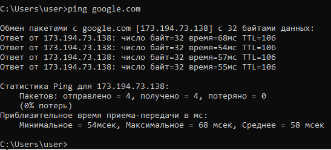{#fig-009 width=80%}

## 3.3.2. Анализ кадров канального уровня в Wireshark

**Результаты ping до google.com:**
- IP адрес: 173.194.73.138
- Время приема-передачи: 54-68 мс
- TTL: 106 (указывает на расстояние в 22 хопа)

## 3.3.2. Анализ кадров канального уровня в Wireshark

**Анализ ICMP пакетов до внешнего ресурса:**

**Эхо-запрос к google.com (пакет 2527):**
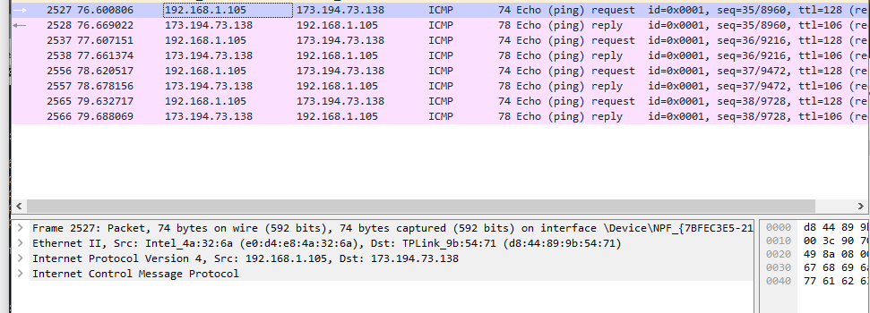{#fig-010 width=90%}

## 3.3.2. Анализ кадров канального уровня в Wireshark

- MAC отправителя: E0-D4-E8-4A-32-6A
- MAC получателя: D8-44-89-9B-54-71
- IP получателя: 173.194.73.138
- TTL: 128

## 3.3.2. Анализ кадров канального уровня в Wireshark

**Эхо-ответ от google.com (пакет 2528):**
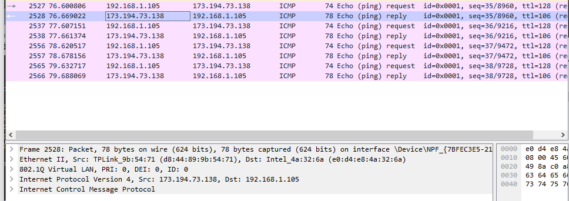{#fig-011 width=90%}

## 3.3.2. Анализ кадров канального уровня в Wireshark

- MAC отправителя: D8-44-89-9B-54-71
- MAC получателя: E0-D4-E8-4A-32-6A
- IP отправителя: 173.194.73.138
- TTL: 106
- **Особенность:** использование VLAN тега (802.1Q)

## 3.3.3. Анализ протоколов транспортного уровня

 Анализ DNS трафика

Применен фильтр `dns` для анализа DNS запросов и ответов:

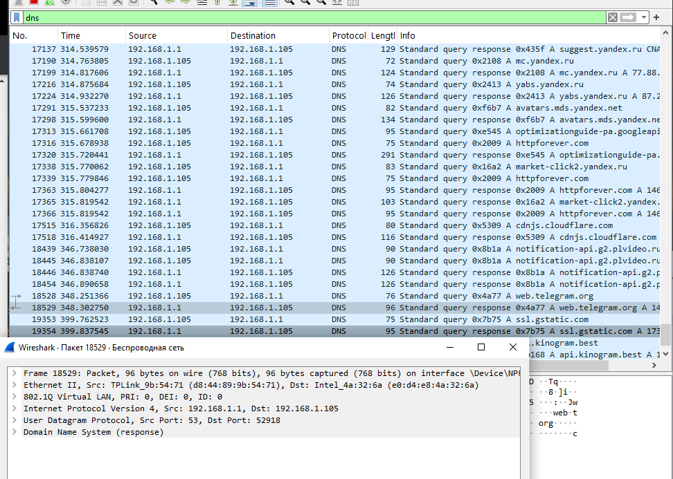{#fig-012 width=90%}

## 3.3.3. Анализ протоколов транспортного уровня

**Детальный анализ DNS трафика:**

**DNS запрос (пакет 17190):**
- Протокол: UDP
- Порт источника: динамический (высокий номер)
- Порт назначения: 53
- Запрос: A-запись для mc.yandex.ru
- Длина: 72 байта

**DNS ответ (пакет 17199):**
- Ответ: A-запись mc.yandex.ru → 77.88.55.77
- Длина: 124 байта
- TTL: 179

**Ключевые особенности DNS:**
- Использование UDP для уменьшения накладных расходов
- Стандартный порт 53
- Кэширование результатов (видно по повторным запросам)
- Поддержка различных типов записов (A, CNAME, etc.)

## Анализ HTTP трафика

Захвачен HTTP трафик при посещении веб-сайтов:

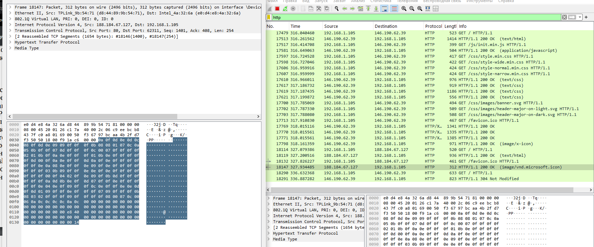{#fig-013 width=90%}

## Анализ HTTP трафика

**Анализ HTTP соединения:**

**HTTP запрос (пакет 17479):**
- Протокол: TCP поверх HTTP/1.1
- Метод: GET /
- HTTP версия: 1.1
- Хост: внешний ресурс
- Установление TCP соединения перед передачей данных

**HTTP ответ (пакет 17543):**
- Статус: 200 OK
- Content-Type: text/html
- Длина: 444 байта
- Передача данных после успешного handshake

**Особенности HTTP анализа:**
- Множественные GET запросы для ресурсов (CSS, изображения)
- Использование порта 80
- Текстовый формат протокола (читаемость в Wireshark)

## Анализ HTTP трафика

 Анализ QUIC трафика

Применен фильтр `quic` для анализа современного протокола QUIC:

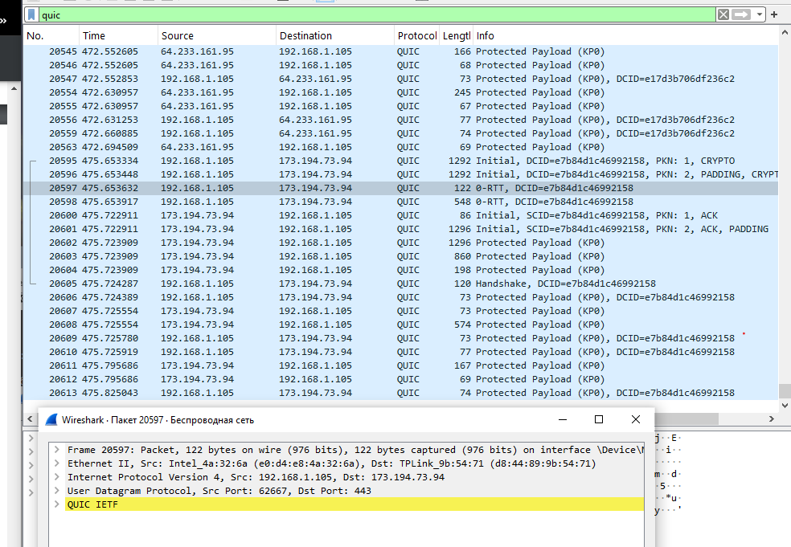{#fig-014 width=90%}

## Анализ HTTP трафика

**Детальный анализ QUIC пакетов:**

**QUIC Initial пакет (пакет 20595):**
- Протокол: QUIC поверх UDP
- Порт назначения: 443
- Тип: Initial
- DCID (Destination Connection ID): e7b84d1c46992158
- Номер пакета: 1
- Содержит: CRYPTO фреймы для handshake

**QUIC Handshake пакет (пакет 20606):**
- Тип: Handshake
- Содержит: параметры шифрования
- Установление безопасного соединения

## Анализ HTTP трафика

**QUIC Protected Payload (пакет 20597):**
- Тип: 0-RTT (Zero Round Trip Time)
- Зашифрованная полезная нагрузка
- Мультиплексирование потоков

**Преимущества QUIC:**
- Работа поверх UDP (обход блокировок)
- Встроенное шифрование (аналогично TLS)
- Мультиплексирование потоков
- Снижение задержек установления соединения
- Устойчивость к изменениям сетевого пути

## 3.3.4. Анализ handshake протокола TCP

Трехступенчатый handshake

Проанализирован процесс установления TCP соединения для HTTP:

**Этапы TCP handshake:**

1. **SYN (Synchronize) - пакет X:**
   - Флаги: SYN=1
   - Sequence Number: ISSa (Initial Sequence Number)
   - Назначение: инициация соединения

2. **SYN-ACK (Synchronize-Acknowledge) - пакет Y:**
   - Флаги: SYN=1, ACK=1
   - Sequence Number: ISSb
   - Acknowledgment Number: ISSa + 1
   - Назначение: подтверждение и ответ

3. **ACK (Acknowledge) - пакет Z:**
   - Флаги: ACK=1
   - Sequence Number: ISSa + 1
   - Acknowledgment Number: ISSb + 1
   - Назначение: завершение handshake
   
 ## 3.3.4. Анализ handshake протокола TCP

 Анализ в Statistics → Flow Graph

Построен график потока TCP для визуализации процесса установления соединения. График показывает временные характеристики и последовательность пакетов during handshake.

## Выводы

В ходе выполнения лабораторной работы №3 были успешно приобретены и закреплены практические навыки анализа сетевого трафика с использованием современного инструментария. Основные достижения:

## 1. Освоение методов MAC-адресации

- Определены MAC-адреса всех сетевых интерфейсов компьютера
- Проведен структурный анализ MAC-адреса E0-D4-E8-4A-32-6A:
  - OUI: E0-D4-E8 (Intel Corporation)
  - Тип: индивидуальный, глобально администрируемый
- Установлено соответствие между IP и MAC-адресами в локальной сети

## 2. Глубокий анализ канального уровня

- Захвачены и проанализированы ARP пакеты, демонстрирующие процесс разрешения адресов
- Исследованы ICMP пакеты (эхо-запросы и ответы) для диагностики сетевых соединений
- Обнаружены различные типы Ethernet кадров: Ethernet II и Ethernet II с VLAN
- Подтверждена периодичность ARP запросов (≈30 секунд) для обновления кэша

## 3. Комплексный анализ транспортного уровня

- **DNS**: Изучен протокол UDP для DNS запросов, показана эффективность для небольших запросов
- **HTTP**: Проанализирован TCP-based протокол с установлением соединения перед передачей данных
- **QUIC**: Исследован современный протокол, демонстрирующий преимущества мультиплексирования и встроенного шифрования

## 4. Исследование TCP handshake

- Подтверждена теоретическая модель трехступенчатого рукопожатия на практике
- Визуализирован процесс установления соединения с помощью Flow Graph
- Проанализированы sequence и acknowledgment numbers

## 5. Практическое применение Wireshark

- Освоены techniques захвата и фильтрации сетевого трафика
- Применены различные display filters для изоляции specific протоколов
- Использованы функции детального анализа пакетов на разных уровнях стека

Работа продемонстрировала эффективность использования анализатора сетевого трафика Wireshark для глубокого понимания принципов работы сетевых протоколов и диагностики сетевых соединений.

## Ответы на контрольные вопросы

1. **Какие типы Ethernet кадров были обнаружены в ходе анализа?**
   Обнаружены два основных типа: Ethernet II (для локальной связи) и Ethernet II с VLAN тегом (802.1Q) для трафика, проходящего через маршрутизатор. VLAN тегирование используется для логического разделения сетевого трафика.

2. **Чем отличается работа протоколов ARP и ICMP?**
   ARP работает на канальном уровне и предназначен для разрешения IP-адресов в MAC-адреса в пределах локальной сети. ICMP работает на сетевом уровне и используется для диагностики соединений, контроля ошибок и управления сетевым трафиком. ARP использует широковещательную рассылку, ICMP - unicast.

3. **Какие основные этапы трехступенчатого handshake TCP?**
   Процесс включает: 1) SYN - клиент инициирует соединение с случайным sequence number; 2) SYN-ACK - сервер подтверждает и отправляет свой sequence number; 3) ACK - клиент подтверждает получение, после чего соединение считается установленным.
   
## Ответы на контрольные вопросы

4. **В чем преимущества протокола QUIC перед TCP?**
   QUIC работает поверх UDP, что обеспечивает: уменьшение задержек установления соединения, встроенное шифрование (аналогичное TLS), мультиплексирование нескольких потоков в одном соединении, устойчивость к изменениям сетевого пути, лучшую производительность в условиях потери пакетов.

5. **Какой протокол используется для DNS запросов и почему?**
   DNS в основном использует UDP на порту 53, поскольку запросы обычно небольшие и не требуют установления соединения, что значительно уменьшает накладные расходы. Для больших ответов может использоваться TCP.

6. **Какие MAC-адреса являются широковещательными?**
   Широковещательный MAC-адрес: FF-FF-FF-FF-FF-FF. Используется в ARP запросах когда устройство ищет владельца определенного IP-адреса в локальной сети.
   
## Ответы на контрольные вопросы

7. **Как определить производителя сетевого оборудования по MAC-адресу?**
   По первым трем байтам (OUI - Organizationally Unique Identifier). Например, OUI E0-D4-E8 соответствует Intel Corporation. Базы данных OUI публично доступны для идентификации производителей.

8. **Какие фильтры Wireshark наиболее полезны для анализа?**
   Основные фильтры: `arp`, `icmp`, `tcp`, `udp`, `dns`, `http`, `quic`, `tcp.port==80`, `udp.port==53`, `ip.addr==192.168.1.105`, `tcp.flags.syn==1`, `tcp.flags.ack==1`.

9. **Почему ICMP ответ обычно больше запроса?**
   ICMP ответ (Echo Reply) обычно содержит дополнительные поля, такие как временные метки и может включать опции, что увеличивает размер пакета compared to запроса. Также может добавляться служебная информация маршрутизаторами.

10. **Как QUIC обеспечивает безопасность соединения?**
    QUIC включает встроенное шифрование на уровне протокола, используя криптографию аналогичную TLS 1.3. Каждый пакет аутентифицируется и шифруется individually, обеспечивая конфиденциальность и целостность данных с момента установления соединения.
    
## Ответы на контрольные вопросы

11. **Что такое TTL в IP пакетах и как он используется?**
    TTL (Time To Live) - 8-битное поле в IP заголовке, которое ограничивает время жизни пакета. Каждый маршрутизатор уменьшает TTL на 1. При достижении 0 пакет отбрасывается. Используется для предотвращения бесконечной циркуляции пакетов.

12. **Как VLAN тегирование влияет на структуру Ethernet кадра?**
    VLAN тег (802.1Q) добавляет 4 байта между полями Source MAC Address и EtherType. Эти 4 байта содержат: TPID (0x8100), PRI (приоритет), DEI (Drop Eligible Indicator), и VID (VLAN ID). Это увеличивает размер кадра на 4 байта.

## Список литературы

1. Wireshark Foundation. Official Documentation. — URL: https://www.wireshark.org/docs/
2. Королькова А. В., Кулябов Д. С. "Сетевые технологии. Лабораторный практикум". — М.: РУДН, 2023.
3. RFC 9000 - "QUIC: A UDP-Based Multiplexed and Secure Transport". — 2021.
4. RFC 793 - "Transmission Control Protocol". — 1981.
5. RFC 826 - "An Ethernet Address Resolution Protocol". — 1982.
6. IANA Protocol Numbers Assignment. — URL: https://www.iana.org/assignments/protocol-numbers/
7. IEEE OUI Registration Authority. — URL: https://standards.ieee.org/products-services/regauth/oui/
8. TCP/IP Guide by Charles M. Kozierok. — No Starch Press, 2005.
