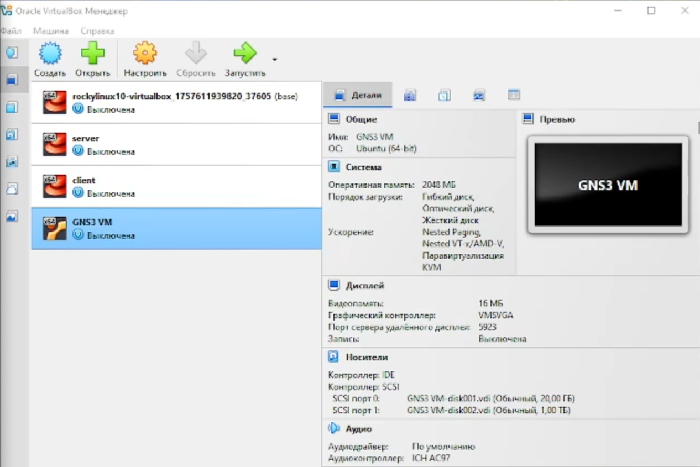
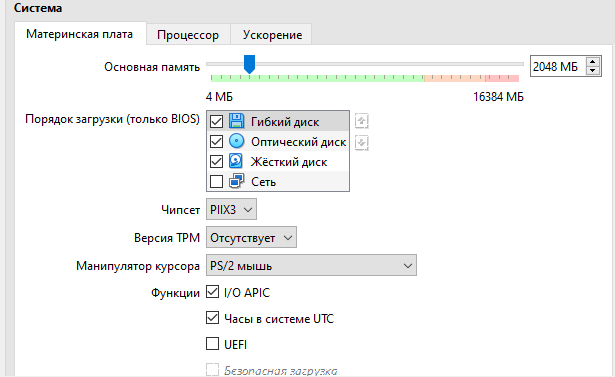
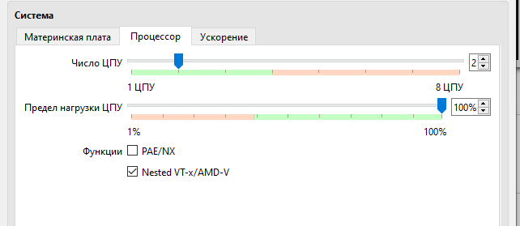
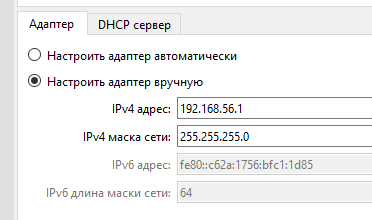
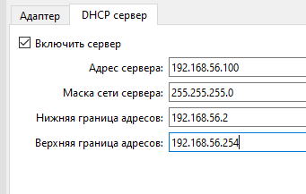
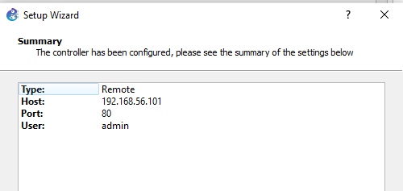
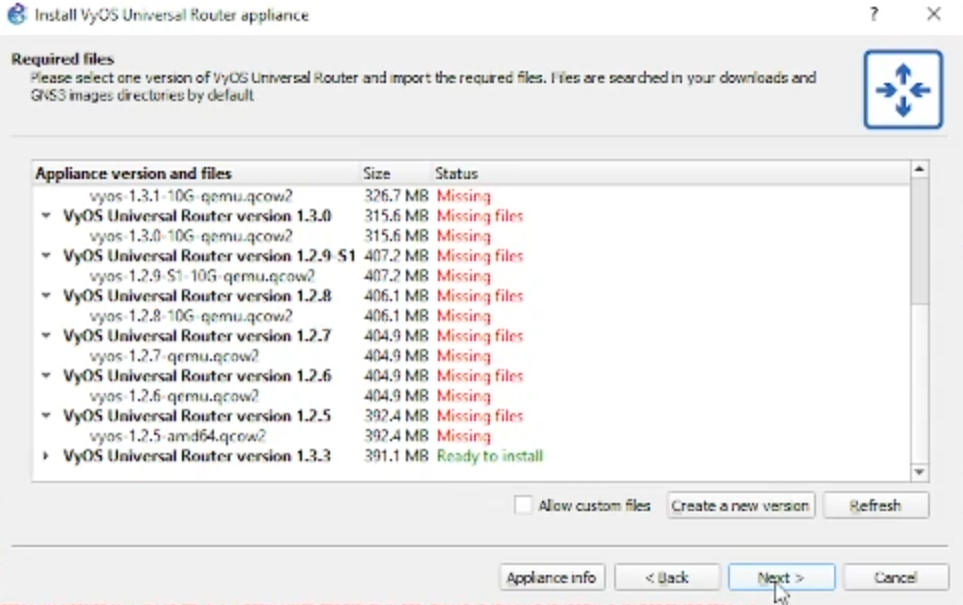

---
## Author
author:
  name: Просина Ксения Максимовна
  degrees: DSc
  orcid: 0000-0002-0877-7063
  email: 1132231845@pfur.ru
  affiliation:
    - name: Российский университет дружбы народов
      country: Российская Федерация
      postal-code: 117198
      city: Москва
      address: ул. Миклухо-Маклая, д. 6
## Title
title: "Сетевые технологии"
subtitle: "Лабораторная работа №4"
license: CC BY
date: today
date-format: "YYYY-MM-DD" # Example: 2025-09-06
---

# Информация

## Докладчик

:::::::::::::: {.columns align=center}
::: {.column width="70%"}

  * Просина Ксения Максимовна
  * Студент 3 курса
  * факультет физико-математических и естественных наук
  * Российский университет дружбы народов им. П. Лумумбы
  * [1132231938@rudn.ru](1132231938@rudn.ru)

:::
::: {.column width="30%"}

:::
::::::::::::::

# Цель работы

Установка и настройка GNS3 и сопутствующего программного обеспечения для создания экспериментального стенда моделирования компьютерных сетей.

Освоение принципов работы сетевого симулятора и подготовка среды для проведения сетевых экспериментов.

# Задание

1. **Установка GNS3-all-in-one** - развертывание основной платформы
2. **Настройка GNS3 VM** - конфигурация виртуальной машины в VirtualBox
3. **Включение вложенной виртуализации** - настройка для улучшения производительности
4. **Конфигурация сети** - настройка адаптеров и DHCP-сервера
5. **Импорт оборудования** - добавление образов маршрутизаторов FRR и VyOS

# Теоретическая часть

## GNS3 - сетевой симулятор

**Основные возможности:**
- Эмуляция реального сетевого оборудования
- Моделирование сложных сетевых топологий
- Тестирование конфигураций маршрутизации
- Отладка сетевых протоколов

**Архитектура системы:**
- GNS3 GUI - клиентская часть с графическим интерфейсом
- GNS3 VM - серверная часть для запуска эмуляторов
- Поддержка различных платформ виртуализации

# Установка GNS3-all-in-one

## Процесс установки

**Использование менеджера пакетов:**
- Установка через Chocolatey в Windows
- Автоматическое разрешение зависимостей
- Установка версии 3.0.5 с дополнительными компонентами

## Завершение установки

**Установленные компоненты:**
- Основное приложение GNS3
- Инструмент TraceNS для трассировки
- Ярлыки в меню "Пуск" и на рабочем столе
- Все файлы в директории C:/Program Files/GNS3/

# Настройка виртуальной машины

## Конфигурация GNS3 VM

**Параметры виртуальной машины:**
- Операционная система: Ubuntu 64-bit
- Оперативная память: 2048 МБ (минимум)
- Процессоры: 2 ЦПУ
- Видеопамять: 16 МБ с контроллером VMSVGA
- Дисковое пространство: 20 ГБ + 1 ТБ

## Аппаратные настройки

**Оптимизация параметров:**
- Увеличение памяти до 16 ГБ для сложных топологий
- Использование чипсета PIIX3 для совместимости
- Включение I/O APIC для работы с прерываниями
- Стандартный порядок загрузки

# Вложенная виртуализация

## Настройка процессора

**Исходное состояние:**
- Отсутствие возможности включить nested virtualization в GUI
- Необходимость использования командной строки
- Критическая важность для производительности эмуляторов

## Активация через командную строку

**Выполнение команды:**
`vboxmanage modifyvm "GNS3 VM" --nested-hw-virt on`

**Результат:**
- Успешная активация вложенной виртуализации
- Возможность эффективной работы эмуляторов QEMU
- Подтверждение в графическом интерфейсе

## Подтверждение настройки

**Проверка результата:**
- Опция "Nested VT-x/AMD-V" активна и включена
- Готовность системы к запуску эмуляторов
- Обеспечение производительной работы GNS3

# Сетевая конфигурация

## Настройка адаптера

**Конфигурация сети:**
- Тип: Виртуальный адаптер хоста
- IPv4 адрес: 192.168.56.1
- Маска подсети: 255.255.255.0
- Ручная настройка для стабильности

## Настройка DHCP-сервера

**Параметры DHCP:**
- Адрес сервера: 192.168.56.100
- Диапазон адресов: 192.168.56.2 - 192.168.56.254
- Автоматическое назначение IP виртуальным устройствам

# Подключение к контроллеру

## Настройка подключения

**Параметры подключения:**
- Протокол: HTTP
- Хост: 192.168.56.101
- Порт: 80
- Пользователь: admin

## Подтверждение подключения

**Итоговые настройки:**
- Тип: Remote
- Успешное подключение к контроллеру
- Готовность к созданию топологий

# Импорт сетевого оборудования

## Выбор оборудования FRR

**Доступные производители:**
- Cisco, Juniper, HPE, Huawei
- FRRouting Project - выбран для лабораторной работы
- Разнообразие эмуляторов и устройств

## Импорт образа FRR

**Характеристики FRR:**
- Версия: 8.2.2
- Размер: 54.0 МБ
- Статус: Ready to install
- Открытая платформа маршрутизации

## Добавление VyOS

**Выбор оборудования:**
- VyOS Universal Router от VyOS Inc.
- Универсальный маршрутизатор на базе Linux
- Поддержка различных сетевых протоколов

## Загрузка версии VyOS

**Доступные версии:**
- Версии от 1.2.5 до 1.3.1
- Различные размеры образов (300-400 МБ)
- Выбор стабильной версии для лабораторной работы

# Результаты установки

## Проверка доступного оборудования

**Успешно импортированы:**
- FRR - открытая платформа маршрутизации
- VyOS Universal Router - универсальный маршрутизатор
- Готовность к созданию сетевых топологий

# Выводы

## Достигнутые результаты

**Успешно выполненные задачи:**
- Установка и настройка GNS3-all-in-one
- Конфигурация GNS3 VM с оптимальными параметрами
- Включение вложенной виртуализации для производительности
- Настройка сетевой инфраструктуры
- Импорт разнообразного сетевого оборудования

## Практическая значимость

**Созданный стенд позволяет:**
- Моделировать сложные сетевые топологии
- Тестировать конфигурации маршрутизации
- Отрабатывать практические навыки сетевого администрирования
- Проводить эксперименты с сетевыми протоколами

# Контрольные вопросы

## Ключевые аспекты работы

1. **Архитектура GNS3** - клиент-серверная модель с GUI и VM
2. **Вложенная виртуализация** - необходимость для производительности эмуляторов
3. **Сетевая настройка** - виртуальный адаптер хоста и DHCP
4. **Импорт оборудования** - процесс добавления новых устройств
5. **FRR и VyOS** - открытые платформы маршрутизации

## Практическое применение

**Полученные навыки позволяют:**
- Создавать сложные сетевые лабораторные стенды
- Тестировать сетевые конфигурации перед внедрением
- Отрабатывать сценарии troubleshooting
- Подготавливаться к сертификациям в области сетей

# Спасибо за внимание!

## Вопросы и ответы

:::::::::::::: {.columns align=center}
::: {.column width="48%"}

**Контактная информация:**
Просина Ксения Максимовна
1132231938@rudn.ru
РУДН, факультет ФМиЕН

:::
::: {.column width="48%"}

**Дополнительные материалы:**
- Полный отчет по лабораторной работе
- Конфигурационные файлы
- Документация GNS3

:::
::::::::::::::
