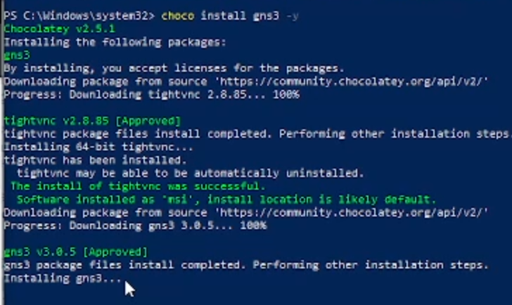
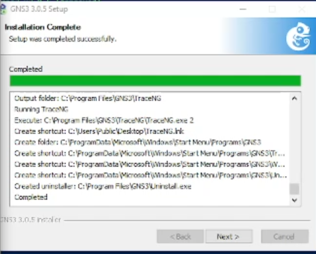
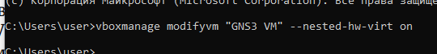
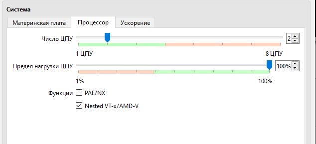
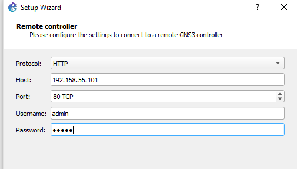
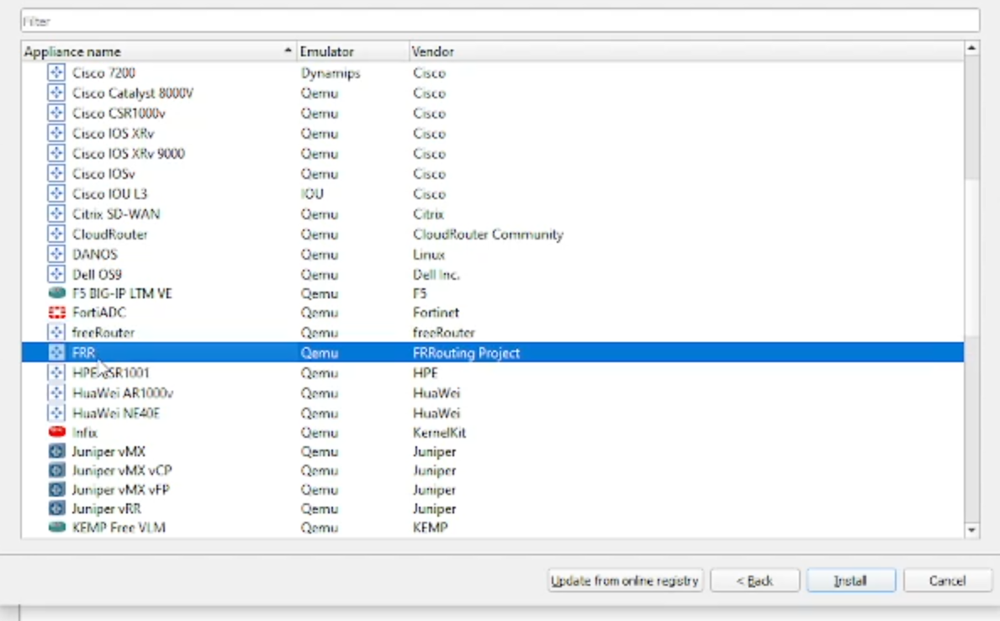
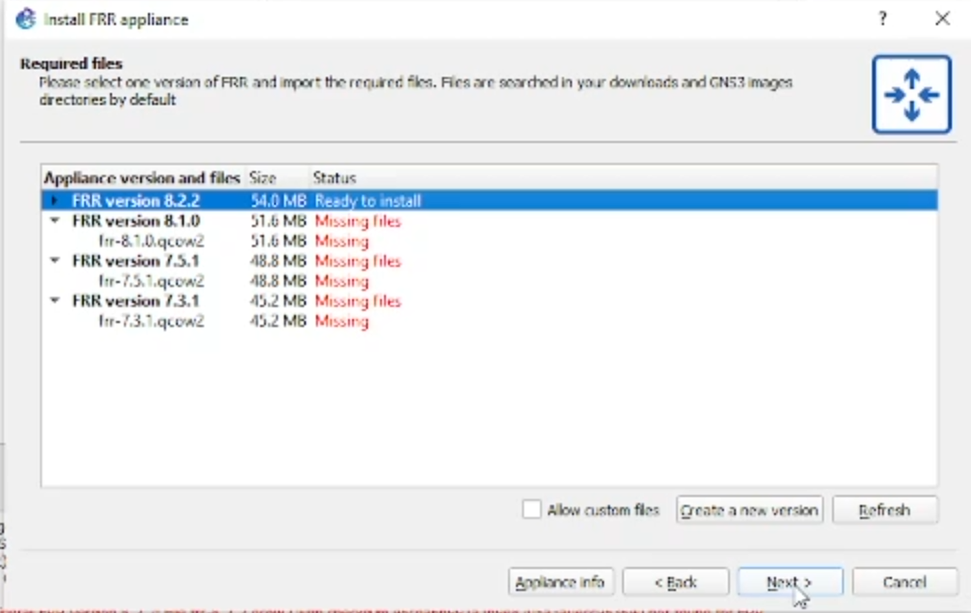
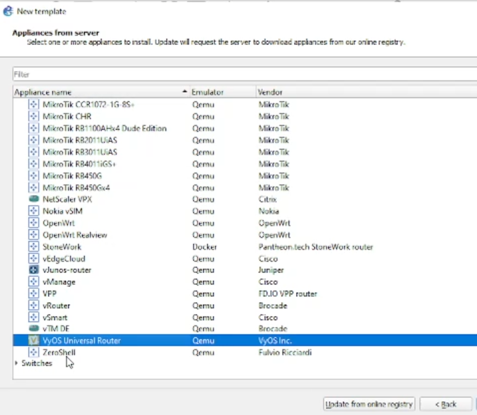
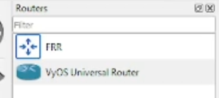

---
## Author
author:
  name: Просина Ксения Максимовна
  degrees: DSc
  orcid: 0000-0002-0877-7063
  email: kulyabov-ds@rudn.ru
  affiliation:
    - name: Российский университет дружбы народов
      country: Российская Федерация
      postal-code: 117198
      city: Москва
      address: ул. Миклухо-Маклая, д. 6

## Title
title: "Сетевые технологии"
subtitle: "Лабораторная работа №4"
license: "CC BY"
---

# Цель работы

Установка и настройка GNS3 и сопутствующего программного обеспечения для создания экспериментального стенда моделирования компьютерных сетей.

# Задание

1. Установить GNS3-all-in-one и проверить корректность установки.
2. Настроить виртуальную машину GNS3 VM в VirtualBox.
3. Включить вложенную виртуализацию для улучшения производительности.
4. Настроить сетевой адаптер и DHCP-сервер для работы GNS3.
5. Импортировать в GNS3 образы маршрутизаторов FRR и VyOS.

# Выполнение лабораторной работы

## Установка GNS3-all-in-one

Процесс установки начался с использования менеджера пакетов Chocolatey для операционной системы Windows. Установка выполнялась из PowerShell с правами администратора.

**Процесс установки:** Команда `choco install gns3 -y` автоматически установила GNS3 версии 3.0.5 вместе с необходимыми зависимостями, включая tightVNC для удаленного доступа. Процесс установки прошел успешно, все компоненты были корректно развернуты.

После завершения установки было получено подтверждение успешной инсталляции:

**Результат установки:** Все компоненты GNS3 были установлены в директорию `C:\Program Files\GNS3\`, созданы ярлыки в меню "Пуск" и на рабочем столе. Установка включала основные компоненты: GNS3 GUI, TraceNS для трассировки сети и вспомогательные утилиты.

## Настройка виртуальной машины GNS3 VM

После установки GNS3 была импортирована и настроена виртуальная машина GNS3 VM в Oracle VirtualBox:

**Параметры виртуальной машины:**
- **Операционная система:** Ubuntu (64-bit)
- **Оперативная память:** 2048 МБ (рекомендуемый минимум)
- **Процессоры:** 2 ЦПУ
- **Видеопамять:** 16 МБ с графическим контроллером VMSVGA
- **Накопители:** Основной диск 20 ГБ и дополнительный диск 1 ТБ для хранения образов

Виртуальная машина была успешно импортирована и готова к запуску в среде VirtualBox.

## Настройка аппаратных параметров

Для оптимальной работы GNS3 были проверены и настроены параметры системы виртуальной машины:

**Конфигурация системы:**
- **Основная память:** 16384 МБ (16 ГБ) - увеличенный объем для работы с сложными топологиями
- **Чипсет:** PIIX3 (стандартный для совместимости)
- **Функции:** Включен I/O APIC для улучшенной работы с прерываниями
- **Порядок загрузки:** Установлен стандартный порядок (гибкий диск, оптический диск, жесткий диск)

## Включение вложенной виртуализации

Ключевым этапом настройки было включение вложенной виртуализации, которая необходима для работы эмуляторов внутри виртуальной машины:

**Исходное состояние:** В графическом интерфейсе VirtualBox отсутствовала возможность включить опцию "Nested VT-x/AMD-V", что требовало использования командной строки.

Для включения вложенной виртуализации была использована команда VBoxManage:

**Выполнение команды:** `vboxmanage modifyvm "GNS3 VM" --nested-hw-virt on` - эта команда активировала поддержку вложенной виртуализации для виртуальной машины GNS3 VM.

После выполнения команды настройки процессора были проверены повторно:

**Результат:** Опция "Nested VT-x/AMD-V" стала активной и включенной, что подтвердило успешное применение настроек. Это критически важно для производительной работы эмуляторов QEMU внутри GNS3.

## Настройка сетевого адаптера

Для обеспечения сетевого взаимодействия был настроен виртуальный адаптер хоста:

**Конфигурация сети:**
- **Тип подключения:** Виртуальный адаптер хоста
- **IPv4 адрес:** 192.168.56.1
- **Маска подсети:** 255.255.255.0
- **IPv6 адрес:** fe80::c62a1756bfc1:1d85/64

Ручная настройка сети обеспечила стабильность и предсказуемость IP-адресации в лабораторной среде.

## Настройка DHCP-сервера

Для автоматического назначения IP-адресов устройствам в GNS3 был настроен DHCP-сервер:

**Параметры DHCP:**
- **Адрес сервера:** 192.168.56.100
- **Маска сети:** 255.255.255.0
- **Диапазон адресов:** 192.168.56.2 - 192.168.56.254

Настройка DHCP обеспечила автоматическое распределение IP-адресов между виртуальными устройствами в GNS3, упрощая процесс конфигурации сетевых топологий.

## Настройка подключения к GNS3 контроллеру

При первом запуске GNS3 был выполнен мастер начальной настройки подключения к удаленному контроллеру:

**Параметры подключения:**
- **Протокол:** HTTP
- **Хост:** 192.168.56.101
- **Порт:** 80
- **Пользователь:** admin

После успешной настройки подключения был отображен итоговый summary конфигурации:

**Результат:** Успешное подключение к удаленному контроллеру GNS3 с указанными параметрами. Система готова к созданию сетевых топологий.

## Импорт образов сетевого оборудования

### Добавление маршрутизатора FRR

Был выполнен процесс импорта образа маршрутизатора FRR (FRRouting) - открытой платформы маршрутизации:

**Доступные образы:** В списке доступных appliance были представлены различные производители сетевого оборудования, включая Cisco, Juniper, HPE и другие. Для лабораторной работы был выбран FRR от FRRouting Project.

После выбора FRR был загружен и импортирован соответствующий образ:

**Версия образа:** FRR version 8.2.2 размером 54.0 МБ. Образ был успешно загружен и готов к установке в среде GNS3.

### Добавление маршрутизатора VyOS

Параллельно был импортирован образ маршрутизатора VyOS - универсального маршрутизатора на базе Linux:

**Выбор оборудования:** В обширном списке доступных appliance был найден "VyOS Universal Router" от VyOS Inc., который был выбран для установки.

Процесс загрузки образа VyOS потребовал выбора конкретной версии:

**Доступные версии:** Были представлены различные версии VyOS от 1.2.5 до 1.3.1. Для лабораторной работы требовалась загрузка соответствующих файлов образов.

## Проверка успешности установки

После завершения процессов импорта была проверена доступность добавленного оборудования в GNS3:

**Результат импорта:** В разделе "Routers" появились добавленные образы - FRR и VyOS Universal Router, что подтвердило успешное выполнение всех этапов установки и настройки экспериментального стенда.

# Выводы

В ходе выполнения лабораторной работы №4 был успешно развернут полнофункциональный экспериментальный стенд GNS3 для моделирования компьютерных сетей. Были выполнены следующие ключевые задачи:

1. **Установка GNS3-all-in-one** - программное обеспечение было корректно установлено через менеджер пакетов Chocolatey, все компоненты развернуты без ошибок.

2. **Настройка виртуальной машины GNS3 VM** - виртуальная машина была импортирована и настроена с оптимальными параметрами: 16 ГБ оперативной памяти, 2 процессора, необходимые объемы дискового пространства.

3. **Включение вложенной виртуализации** - критически важная настройка была успешно применена через командную строку VBoxManage, что обеспечило поддержку эмуляции оборудования внутри виртуальной среды.

4. **Конфигурация сети** - настроен виртуальный адаптер хоста с ручной IP-адресацией и DHCP-сервером для автоматического распределения адресов в создаваемых сетевых топологиях.

5. **Импорт сетевого оборудования** - успешно добавлены образы маршрутизаторов FRR и VyOS, что предоставило разнообразные инструменты для моделирования различных сетевых сценариев.

Полученный экспериментальный стенд готов к использованию для создания сложных сетевых топологий, тестирования конфигураций маршрутизации и отработки практических навыков в области сетевых технологий. Стенд обеспечивает гибкость и масштабируемость для проведения различных лабораторных работ и исследований.

# Ответы на контрольные вопросы

1. **Что такое GNS3 и для чего он используется?**
   GNS3 (Graphical Network Simulator 3) - это программное обеспечение с открытым исходным кодом для эмуляции компьютерных сетей. Он используется для моделирования, настройки, тестирования и устранения неполадок виртуальных и реальных сетей.

2. **Какие компоненты входят в состав GNS3?**
   GNS3 состоит из двух основных компонентов: GNS3-all-in-one software (клиентская часть с GUI) и GNS3 virtual machine (серверная часть для запуска эмуляторов).

3. **Что такое вложенная виртуализация и почему она важна для GNS3?**
   Вложенная виртуализация позволяет запускать виртуальные машины внутри других виртуальных машин. Для GNS3 это критически важно, так как позволяет эмуляторам (например QEMU) эффективно работать внутри GNS3 VM.

4. **Как настроить сетевой адаптер для GNS3 VM?**
   Сетевой адаптер настраивается в VirtualBox как "Виртуальный адаптер хоста" с ручной или автоматической настройкой IP-адресации и DHCP-сервера для раздачи адресов виртуальным устройствам.

5. **Какие образы сетевого оборудования можно импортировать в GNS3?**
   В GNS3 можно импортировать образы различных производителей: Cisco, Juniper, FRR, VyOS, MikroTik и многие другие. Образы могут быть как эмулированными (с реальными IOS), так и смоделированными.

6. **Как происходит процесс импорта нового оборудования в GNS3?**
   Процесс импорта включает: выбор источника (GNS3 сервер), выбор конкретного appliance, загрузку необходимых файлов образа, настройку параметров эмулятора и финальную установку в среду GNS3.

7. **Какие минимальные системные требования для GNS3 VM?**
   Минимальные требования: 2048 МБ ОЗУ, 2 процессора, 20 ГБ дискового пространства. Рекомендуется 8+ ГБ ОЗУ для работы со сложными топологиями.

8. **Как проверить успешность установки GNS3?**
   Успешность установки проверяется запуском GNS3 GUI, подключением к GNS3 VM и наличием импортированного оборудования в панели устройств.

9. **Что такое FRR и VyOS?**
   FRR (FRRouting) - открытая платформа маршрутизации с поддержкой BGP, OSPF, IS-IS и других протоколов. VyOS - универсальный маршрутизатор на базе Linux с интерфейсом командной строки похожим на Juniper JunOS.

10. **Для чего нужен DHCP-сервер в настройках GNS3?**
    DHCP-сервер автоматически назначает IP-адреса виртуальным устройствам в GNS3, упрощая процесс настройки сетевых интерфейсов и экономя время при создании сложных топологий.

# Список литературы{.unnumbered}

1. GNS3 Documentation. — URL: https://docs.gns3.com/docs/
2. GNS3 Official Website. — URL: https://gns3.com
3. FRRouting Documentation. — URL: https://docs.frrouting.org/
4. VyOS Documentation. — URL: https://docs.vyos.io/
5. VirtualBox Manual. — URL: https://www.virtualbox.org/manual/