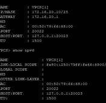
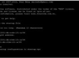
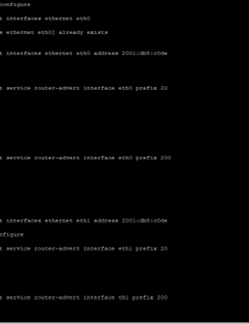
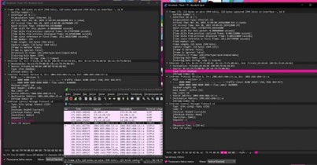

---
## Author
author:
  name: Просина Ксения Максимовна
  degrees: DSc
  orcid: 0000-0002-0877-7063
  email: 1132231845@pfur.ru
  affiliation:
    - name: Российский университет дружбы народов
      country: Российская Федерация
      postal-code: 117198
      city: Москва
      address: ул. Миклухо-Маклая, д. 6
## Title
title: "Сетевые технологии"
subtitle: "Лабораторная работа №6"
license: CC BY
date: today
date-format: "YYYY-MM-DD" # Example: 2025-09-06
---

# Информация

## Докладчик

:::::::::::::: {.columns align=center}
::: {.column width="70%"}

  * Просина Ксения Максимовна
  * Студент 3 курса
  * факультет физико-математических и естественных наук
  * Российский университет дружбы народов им. П. Лумумбы
  * [1132231938@rudn.ru](1132231938@rudn.ru)

:::
::: {.column width="30%"}

:::
::::::::::::::

# Цель работы

## Цель работы

Изучение принципов распределения адресного пространства и получение навыков настройки IPv4/IPv6-адресации на сетевых устройствах. Рассматриваются способы разбиения сетей на подсети и технология Dual Stack.

# Задание

## Задание

1. Выполнить теоретическое задание по разделению сети на подсети.
2. Настроить двойной стек адресации IPv4 и IPv6 в локальной сети.
3. Выполнить самостоятельную работу для закрепления тем.
4. Проанализировать захваченный трафик ARP, ICMP и ICMPv6.

# Теоретическая часть

## Разбиение IPv4-сетей

**Сеть 172.16.20.0/24**: префикс /24, маска 255.255.255.0, broadcast 172.16.20.255, диапазон узлов 1-254.

**Разбиение на подсети:**
- 126 узлов: /25 (255.255.255.128) - 172.16.20.0/25
- 62 узла: /26 (255.255.255.192) - 172.16.20.128/26
- 62 узла: /26 - 172.16.20.192/26

## Разбиение IPv4-сетей (продолжение)

**Сеть 10.10.1.64/26**: префикс /26, маска 255.255.255.192, broadcast 10.10.1.127, диапазон 65-126.

**Подсеть на 30 узлов:** /27 (255.255.255.224) - 10.10.1.64/27, диапазон 65-94.

**Сеть 10.10.1.0/26**: префикс /26, broadcast 10.10.1.63, диапазон 1-62.

**Подсеть на 14 узлов:** /28 (255.255.255.240) - 10.10.1.0/28, диапазон 1-14.

## Разбиение IPv6-сетей

**Сеть 2001:db8:c0de::/48** (Global Unicast)

**Через ID подсети (/49):**
- 2001:db8:c0de:0000::/49
- 2001:db8:c0de:8000::/49

**Через ID интерфейса (/68):**
- 2001:db8:c0de:0000:0000::/68
- 2001:db8:c0de:0000:1000::/68

# Выполнение лабораторной работы

## Запускаем окно wireshark

Перед настройкой запущен захват трафика в Wireshark для последующего анализа протоколов ARP, ICMP и ICMPv6/NDP.

## Настройка интерфейсов маршрутизатора FRR

На первом этапе настроена IPv4-часть сети. На интерфейсы маршрутизатора FRR назначены IP-адреса согласно таблице адресации.

## Вывод ip адрессов PC1 и PC2

Настроены оконечные устройства PC1 и PC2. Корректность проверена командами show ip.

## Конфигурация IPv4 на маршрутизаторе FRR

Интерфейс eth0: 172.16.20.1/25, eth1: 172.16.20.129/25. После настройки проверена связность между PC1 и PC2 командой ping.

## Задание ipv6 адресов части для server, PC3, PC4

Настроена IPv6-часть сети на базе маршрутизатора VyOS. На интерфейсы назначены статические IPv6-адреса.

## Выполнение команд для настройки Vyos часть

Команды set interfaces ethernet назначают адреса, router-advert настраивает рассылку RA для автоконфигурации клиентов по SLAAC.

## Анализ ARP-запросов в Wireshark

На скриншоте видны ARP-запросы и ответы в IPv4-подсети. Запрос "Who has 172.16.20.10?" демонстрирует разрешение IP-адресов в MAC-адреса.

## Анализ ARP-запросов в Wireshark

В поле "Target IP address" виден запрашиваемый адрес, в ответе содержится соответствующий MAC-адрес.

## Анализ ARP-запросов в Wireshark

В IPv6 роль ARP выполняет NDP (Neighbor Discovery Protocol) поверх ICMPv6. Видны сообщения Router Solicitation, Router Advertisement, Neighbor Solicitation.

# Самостоятельное задание

## Характеристика подсетей

**Подсеть 1:** 10.10.1.96/27, 2001:DB8:1:1::/64
- Диапазон IPv4: 97-126, узлов: 30, broadcast: 127

**Подсеть 2:** 10.10.1.16/28, 2001:DB8:1:4::/64
- Диапазон IPv4: 17-30, узлов: 14, broadcast: 31

## Таблица адресации

| Устройство | IPv4-адрес | IPv6-адрес | Шлюз |
|------------|------------|------------|------|
| Server | 10.10.1.97/27 | 2001:DB8:1:1::1/64 | — |
| Server | 10.10.1.17/28 | 2001:DB8:1:4::1/64 | — |
| PC1-user | 10.10.1.98/27 | 2001:DB8:1:1::2/64 | 10.10.1.97 |
| PC2-user | 10.10.1.18/28 | 2001:DB8:1:4::2/64 | 10.10.1.17 |

На маршрутизаторе установлены наименьшие адреса в подсети.

## Результаты самостоятельного задания

Настройка выполнена согласно таблице. Проверка ping подтвердила полную связность всех устройств.

# Выводы

## Выводы

1. Освоено разбиение IPv4-сетей на подсети с использованием VLSM.

2. Изучены принципы IPv6-адресации и методы разбиения на подсети.

3. Успешно настроена технология Dual Stack в GNS3.

## Выводы (продолжение)

4. Проведен анализ трафика, выявлены различия ARP (IPv4) и NDP (IPv6).

5. Подтверждена корректность настройки маршрутизаторов FRR и VyOS.

**Цель работы достигнута.**

# Список литературы

## Список литературы

1. Королькова А. В., Кульбов Д. С. Администрирование сетевых подсистем. Лабораторная работа №6.

2. RFC 791 - Internet Protocol (IPv4)

3. RFC 2460 - Internet Protocol, Version 6 (IPv6)

4. RFC 4213 - Basic Transition Mechanisms

5. RFC 4861 - Neighbor Discovery for IPv6
