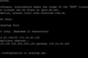
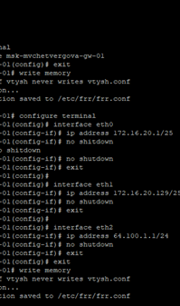
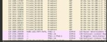
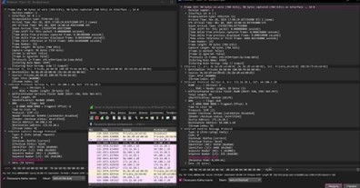

---
## Author
author:
  name: Просина Ксения Максимовна
  degrees: DSc
  orcid: 0000-0002-0877-7063
  email: 1132231938@pfur.ru
  affiliation:
    - name: Российский университет дружбы народов
      country: Российская Федерация
      postal-code: 117198
      city: Москва
      address: ул. Миклухо-Маклая, д. 6

## Title
title: "Сетевые технологии"
subtitle: "Лабораторная работа №6"
license: "CC BY"
date: today
date-format: "YYYY-MM-DD"
---

# Цель работы

Целью данной лабораторной работы является изучение принципов распределения адресного пространства в компьютерных сетях, а также получение практических навыков настройки IPv4- и IPv6-адресации на сетевых устройствах. В ходе выполнения работы рассматриваются способы разбиения сетей на подсети и особенности совместного использования двух версий протокола IP.

# Задание

1. Выполнить теоретическое задание по разделению сети на подсети.
2. Настроить двойной стек (Dual Stack) адресации IPv4 и IPv6 в локальной сети.
3. Выполнить самостоятельную работу для закрепления изученных тем.

# Теоретические сведения

## IPv4-адресация

Длина IPv4-адреса составляет 32 бита. Для удобства используется десятично-точечная нотация (например, 192.168.1.1). Структурно в адресе выделяют сетевой префикс (адрес сети и подсети) и идентификатор узла. Граница между ними определяется маской подсети (Subnet Mask) или длиной префикса в CIDR-нотации (например, /24).

С помощью масок переменной длины (VLSM) можно разбивать сети на подсети разного размера, что позволяет эффективно использовать адресное пространство. Количество узлов в подсети вычисляется по формуле 2^n - 2, где n — количество бит, отведенных под узлы.

## IPv6-адресация

IPv6-адрес имеет длину 128 бит и записывается в шестнадцатеричном формате с двоеточиями (например, 2001:db8::1). Для сокращения записи опускаются ведущие нули, а длинные последовательности нулей заменяются на двойное двоеточие (::).

В IPv6 существуют различные типы адресов:
- Global Unicast: Глобальные маршрутизируемые адреса (префикс 2000::/3)
- Link-Local Unicast: Адреса для связи в пределах одного сегмента сети (префикс FE80::/10)
- Unique Local Addresses (ULA): Аналог частных адресов IPv4 (FC00::/7)
- Multicast: Адреса для многоадресной рассылки (FF00::/8)

Для разрешения адресов канального уровня в IPv6 вместо ARP используется протокол NDP (Neighbor Discovery Protocol), работающий на основе ICMPv6.

# Выполнение лабораторной работы

## Разбиение сети на подсети

### Разбиение IPv4-сети на подсети

**Сеть 172.16.20.0/24**

- Адрес сети: 172.16.20.0
- Префикс: /24
- Маска подсети: 255.255.255.0
- Broadcast: 172.16.20.255
- Диапазон узлов: 172.16.20.1 – 172.16.20.254
- Количество узлов: 254

Разбиение на подсети 126, 62 и 62 узла:

Для 126 узлов:
- Требуется: 126 узлов → 2^7 = 128 - 2 = 126
- Новая маска: /25 (255.255.255.128)
- Адрес подсети: 172.16.20.0/25
- Диапазон узлов: 172.16.20.1 – 172.16.20.126
- Broadcast: 172.16.20.127

Для 62 узлов (первая подсеть):
- Требуется: 62 узла → 2^6 = 64 - 2 = 62
- Новая маска: /26 (255.255.255.192)
- Адрес подсети: 172.16.20.128/26
- Диапазон узлов: 172.16.20.129 – 172.16.20.190
- Broadcast: 172.16.20.191

Для 62 узлов (вторая подсеть):
- Адрес подсети: 172.16.20.192/26
- Диапазон узлов: 172.16.20.193 – 172.16.20.254
- Broadcast: 172.16.20.255

**Сеть 10.10.1.64/26**

- Адрес сети: 10.10.1.64
- Префикс: /26
- Маска: 255.255.255.192
- Broadcast: 10.10.1.127
- Диапазон узлов: 10.10.1.65 - 10.10.1.126
- Количество узлов: 62

Разбиение на подсети 30 узлов:

Для 30 узлов:
- Требуется: 30 узлов → 2^5 = 32 - 2 = 30
- Новая маска: /27 (255.255.255.224)
- Адрес подсети: 10.10.1.64/27
- Диапазон узлов: 10.10.1.65 - 10.10.1.94
- Broadcast: 10.10.1.95

**Сеть 10.10.1.0/26**

- Адрес сети: 10.10.1.0
- Префикс: /26
- Маска: 255.255.255.192
- Broadcast: 10.10.1.63
- Диапазон узлов: 10.10.1.1 - 10.10.1.62
- Количество узлов: 62

Разбиение на подсети 14 узлов:

Для 14 узлов:
- Требуется: 14 узлов → 2^4 = 16 - 2 = 14
- Новая маска: /28 (255.255.255.240)
- Адрес подсети: 10.10.1.0/28
- Диапазон узлов: 10.10.1.1 - 10.10.1.14
- Broadcast: 10.10.1.15

### Разбиение IPv6-сетей на подсети

**Сеть 2001:db8:c0de::/48**

- Тип адреса: Global Unicast (зарезервирован для документации)
- Префикс: /48
- Маска: ffff:ffff:ffff::
- Диапазон адресов узлов: от 2001:db8:c0de:0000:0000:0000:0000:0000 до 2001:db8:c0de:ffff:ffff:ffff:ffff:ffff

Разбиение на 2 подсети с использованием идентификатора подсети:

- Новый префикс: /49
- Подсеть 1: 2001:db8:c0de:0000::/49
- Подсеть 2: 2001:db8:c0de:8000::/49
(Добавляем 1 бит к префиксу (48 → 49), разделяя пространство на 2 равные части)

Разбиение на 2 подсети с использованием идентификатора интерфейса:

- Новый префикс: /68
- Подсеть 1: 2001:db8:c0de:0000:0000::/68
- Подсеть 2: 2001:db8:c0de:0000:1000::/68
(Забираем 4 бита из идентификатора интерфейса для создания подсетей)

**Сеть 2a02:6b8::/64**

- Тип адреса: Global Unicast
- Префикс: /64
- Маска: ffff:ffff:ffff:ffff::
- Диапазон адресов узлов:
  - Первый узел: 2a02:6b8:0000:0000:0000:0000:0000:0001
  - Последний узел: 2a02:6b8:0000:0000:ffff:ffff:ffff:ffff

Разбиение на 2 подсети с использованием идентификатора подсети:

- Новый префикс: /65
- Подсеть 1: 2a02:6b8:0000:0000::/65
- Подсеть 2: 2a02:6b8:0000:0000:8000::/65

Разбиение на 2 подсети с использованием идентификатора интерфейса:

- Новый префикс: /68
- Подсеть 1: 2a02:6b8:0000:0000:0000::/68
- Подсеть 2: 2a02:6b8:0000:0000:1000::/68

## Настройка двойного стека адресации IPv4 и IPv6 в локальной сети

### Создание топологии сети

В ходе работы была реализована топология сети в соответствии с методическими указаниями. Схема включает в себя две локальные подсети: IPv4-подсеть с адресами 172.16.20.0/25 и IPv6-подсеть с префиксом 2001:db8:c0de::/48. Устройства соединены через коммутаторы с маршрутизаторами FRR и VyOS.

### Настройка IPv4-адресации

Перед началом настройки был запущен захват трафика в Wireshark для последующего анализа.

На первом этапе была настроена IPv4-часть сети. В соответствии с таблицей адресации, на интерфейсы маршрутизатора FRR были назначены IP-адреса.

Далее были настроены оконечные устройства PC1 и PC2. Корректность настройки проверялась командами show ip.

Настройка маршрутизатора FRR msk-user-gw-01 была выполнена с использованием следующих команд. Интерфейс eth0 получил адрес 172.16.20.1/25 для первой подсети, eth1 - 172.16.20.129/25 для второй подсети, что обеспечивает маршрутизацию между сегментами IPv4-сети.

После настройки всех устройств была проверена связность между узлами IPv4-подсети с помощью команды ping. Успешные эхо-запросы между узлами PC1 и PC2 подтверждают корректную настройку адресации и маршрутизации между различными сегментами IPv4-сети.

### Настройка IPv6-адресации

На следующем этапе была настроена IPv6-часть сети на базе маршрутизатора VyOS. На интерфейсы были назначены статические IPv6-адреса и настроена рассылка объявлений маршрутизатора (RA) для автоматической настройки клиентов по протоколу SLAAC.

Команды set interfaces ethernet назначают статические адреса интерфейсам, а router-advert настраивает рассылку RA-сообщений.

Проверка связи между узлами PC3 и PC4 в IPv6-подсети подтвердила работоспособность IPv6-маршрутизации через маршрутизатор VyOS. Ответы от 2001:db8:c0de:13::a подтверждают корректность настроек.

### Анализ сетевого трафика

Для анализа сетевого трафика был выполнен захват пакетов на интерфейсе сервера. Анализ трафика позволяет увидеть различия в работе протоколов IPv4 и IPv6.

На скриншоте Wireshark видны ARP-запросы и ответы в IPv4-подсети. ARP-запрос "Who has 172.16.20.10" демонстрирует процесс разрешения IP-адресов в MAC-адреса на канальном уровне.

В IPv6-сети роль ARP выполняет протокол NDP (Neighbor Discovery Protocol), работающий поверх ICMPv6. На следующем скриншоте видны сообщения Router Solicitation, Router Advertisement, а также Neighbor Solicitation для разрешения адресов.

### Самостоятельное задание

1. Характеристика подсетей:

**Подсеть 1:**
- IPv4: 10.10.1.96/27
- IPv6: 2001:DB8:1:1::/64
- Диапазон IPv4: 10.10.1.97 - 10.10.1.126
- Число узлов IPv4: 30
- Broadcast IPv4: 10.10.1.127
- Диапазон IPv6: 2001:DB8:1:1::1 - 2001:DB8:1:1:ffff:ffff:ffff:ffff

**Подсеть 2:**
- IPv4: 10.10.1.16/28
- IPv6: 2001:DB8:1:4::/64
- Диапазон IPv4: 10.10.1.17 - 10.10.1.30
- Число узлов IPv4: 14
- Broadcast IPv4: 10.10.1.31
- Диапазон IPv6: 2001:DB8:1:4::1 - 2001:DB8:1:4:ffff:ffff:ffff:ffff

2. Таблица адресации для самостоятельного задания:

- Dual Stack Server: IPv4: 10.10.1.97/27 и 10.10.1.17/28; IPv6: 2001:DB8:1:1::1/64 и 2001:DB8:1:4::1/64
- PC1-user: IPv4: 10.10.1.98/27 (шлюз 10.10.1.97); IPv6: 2001:DB8:1:1::2/64 (шлюз 2001:DB8:1:1::1)
- PC2-user: IPv4: 10.10.1.18/28 (шлюз 10.10.1.17); IPv6: 2001:DB8:1:4::2/64 (шлюз 2001:DB8:1:4::1)

3. Настройка IP-адресации на маршрутизаторе VyOS и оконечных устройствах выполнена в соответствии с таблицей, причём на интерфейсах маршрутизатора установлены наименьшие адреса в подсети.

4. Проверка подключения между устройствами подсети с помощью команд ping подтвердила полную связность всех устройств согласно заданию.

# Выводы

В ходе лабораторной работы были успешно изучены и практически применены принципы адресации IPv4 и IPv6. Основные достижения:

1. Освоено разбиение IPv4-сетей на подсети с использованием технологии VLSM (Variable Length Subnet Mask), что позволяет эффективно распределять адресное пространство согласно требованиям к количеству узлов в каждой подсети.

2. Изучены принципы IPv6-адресации, включая различные типы адресов (Unicast, Anycast, Multicast), форматы записи и методы сокращения записи адресов. Практически опробованы два подхода к разбиению IPv6-сетей на подсети.

3. Успешно настроена технология Dual Stack в среде GNS3, что подтверждено работоспособностью обеих IP-версий в одной сетевой инфраструктуре. Сервер с двойным стеком демонстрирует возможность одновременной работы с устройствами обеих подсетей.

4. Проведен анализ сетевого трафика, позволивший на практике увидеть различия в механизмах разрешения адресов между IPv4 (ARP) и IPv6 (Neighbor Discovery Protocol).

5. Подтверждена корректность настройки маршрутизаторов FRR и VyOS, а также оконечных устройств, что демонстрирует понимание принципов маршрутизации в гетерогенных сетях.

Результаты работы подтверждают достижение поставленной цели - изучение принципов распределения и настройки адресного пространства на сетевых устройствах.

# Список литературы

1. Королькова А. В., Кульбов Д. С. Администрирование сетевых подсистем. Лабораторная работа №6.
2. RFC 791 - Internet Protocol (IPv4)
3. RFC 2460 - Internet Protocol, Version 6 (IPv6) Specification
4. RFC 4213 - Basic Transition Mechanisms for IPv6 Hosts and Routers
5. RFC 4861 - Neighbor Discovery for IP version 6 (IPv6)