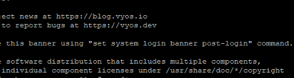
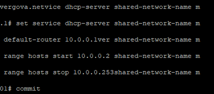
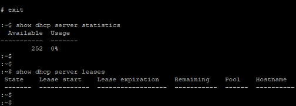
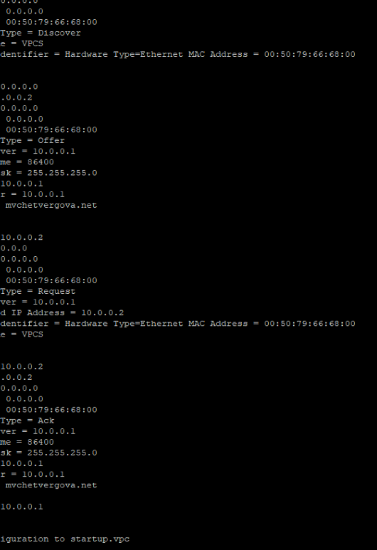
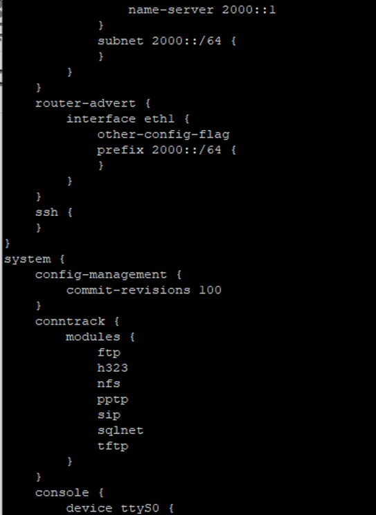

---
## Author
author:
  name: Просина Ксения Максимовна
  degrees: DSc
  orcid: 0000-0002-0877-7063
  email: 1132231938@pfur.ru
  affiliation:
    - name: Российский университет дружбы народов
      country: Российская Федерация
      postal-code: 117198
      city: Москва
      address: ул. Миклухо-Маклая, д. 6
## Title
title: "Сетевые технологии"
subtitle: "Лабораторная работа №7"
license: CC BY
date: today
date-format: "YYYY-MM-DD" # Example: 2025-09-06
---

# Информация

## Докладчик

:::::::::::::: {.columns align=center}
::: {.column width="70%"}

  * Просина Ксения Максимовна
  * Студент 3 курса
  * факультет физико-математических и естественных наук
  * Российский университет дружбы народов им. П. Лумумбы
  * [1132231938@rudn.ru](1132231938@rudn.ru)

:::
::: {.column width="30%"}

:::
::::::::::::::

# Цель работы

## Цель работы

Получение навыков настройки службы DHCP на сетевом оборудовании для распределения адресов IPv4 и IPv6.

# Задание

## Задание

1. Настроить DHCP-сервер для IPv4 на маршрутизаторе VyOS.
2. Настроить DHCPv6 в двух режимах:
   - Stateless (без отслеживания состояния)
   - Stateful (с отслеживанием состояния)
3. Исследовать процесс получения адресов с помощью Wireshark.

# Теоретические сведения

## Протокол DHCP

DHCP (Dynamic Host Configuration Protocol) - позволяет устройствам автоматически получать IP-адрес и параметры сети.

Процесс DORA:
- Discover - клиент ищет сервер
- Offer - сервер предлагает адрес
- Request - клиент запрашивает адрес
- Acknowledge - сервер подтверждает

## Протокол DHCPv6

Два режима работы:
- Stateless: адрес через SLAAC, параметры (DNS) через DHCPv6
- Stateful: полная конфигурация (адрес + DNS) через DHCPv6

Флаги в RA:
- other-config-flag: запрашивать только параметры
- managed-flag: запрашивать адрес и параметры

# Настройка DHCP для IPv4

## Базовая конфигурация VyOS

Выполнена начальная настройка маршрутизатора: изменено имя хоста, задано доменное имя, создан новый пользователь.

## Конфигурация DHCPv4-сервера

Создан пул адресов 10.0.0.2-10.0.0.253, указаны шлюз, DNS-сервер и доменное имя.

## Статистика до выдачи адресов

Перед запуском клиента аренд нет, все адреса доступны.

## Процесс получения адреса на PC1

На клиенте выполнена команда ip dhcp -d, отобразившая процесс DDORA.

# Настройка DHCPv6

## Настройка IPv6-адресов на маршрутизаторе

Интерфейсам eth1 и eth2 назначены статические IPv6-адреса.

## Настройка DHCPv6 Stateless

На интерфейсе eth1 настроен флаг other-config-flag. Создан DHCPv6-сервер без пула адресов, только с DNS.

## Получение DNS через DHCPv6 Stateless

Клиент запросил только параметры конфигурации, не запрашивая адрес.

## Состояние PC3 до получения адреса

Глобальный IPv6-адрес отсутствует, только link-local.

## Итоговая проверка на PC3

Клиент получил адрес 2001::100, маршрут и DNS-сервер.

## Анализ трафика DHCPv6 Stateful

В Wireshark видна полная последовательность с назначением адреса.

# Выводы

## Выводы

1. Освоена настройка DHCPv4 на маршрутизаторе VyOS. Подтверждён процесс DORA.

2. Реализованы два режима DHCPv6:
   - Stateless: SLAAC + DNS от DHCPv6
   - Stateful: полная конфигурация от DHCPv6

3. Проведён анализ трафика, выявлены различия в работе режимов.

4. Приобретён навык работы с CLI VyOS и анализатором трафика.
