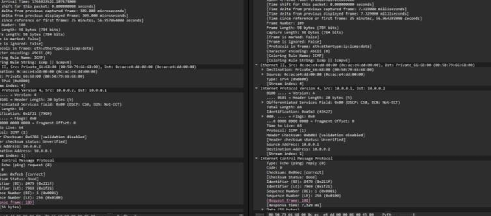
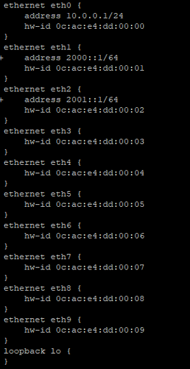
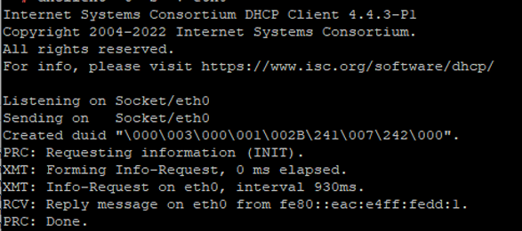
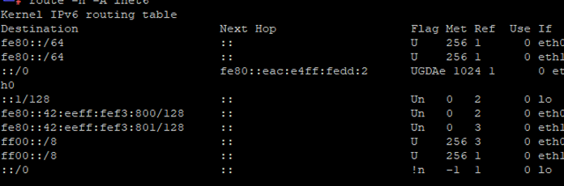
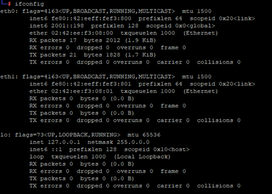
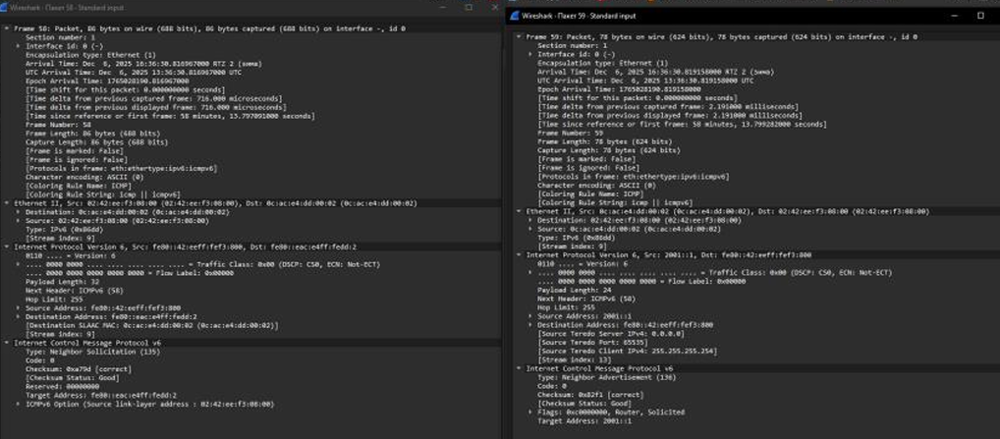

---
## Author
author:
  name: Просина Ксения Максимовна
  degrees: DSc
  orcid: 0000-0002-0877-7063
  email: 1132231938@pfur.ru
  affiliation:
    - name: Российский университет дружбы народов
      country: Российская Федерация
      postal-code: 117198
      city: Москва
      address: ул. Миклухо-Маклая, д. 6

## Title
title: "Сетевые технологии"
subtitle: "Лабораторная работа №7"
license: "CC BY"
---

# Цель работы

Получение навыков настройки службы DHCP на сетевом оборудовании для распределения адресов IPv4 и IPv6.

# Задание

1. Настроить DHCP-сервер для распределения IPv4-адресов на маршрутизаторе VyOS.
2. Настроить DHCPv6 в двух режимах:
   - Без отслеживания состояния (Stateless) для передачи дополнительных параметров (DNS) при использовании SLAAC.
   - С отслеживанием состояния (Stateful) для полного распределения IPv6-адресов.
3. Исследовать процесс получения адресов с помощью анализатора сетевого трафика.

# Теоретические сведения

## Dynamic Host Configuration Protocol

Протокол динамической конфигурации узла (DHCP) — сетевой протокол, позволяющий устройствам автоматически получать IP-адрес и другие параметры, необходимые для работы в сети TCP/IP. DHCP работает по модели «клиент–сервер» и позволяет избежать ручной настройки компьютеров сети.

Процесс получения устройством адреса по протоколу DHCP включает четыре этапа:
- DHCP DISCOVER: устройство отправляет широковещательный запрос
- DHCP OFFER: сервер предлагает адрес и параметры
- DHCP REQUEST: клиент соглашается с полученными параметрами
- DHCP ACKNOWLEDGE: сервер подтверждает регистрацию адреса

## Dynamic Host Configuration Protocol version 6

DHCPv6 — протокол для конфигурации узлов IPv6-адресами. В IPv6 настройку адресов можно проводить и без DHCP — такой подход называется SLAAC (автоматическая настройка адреса без отслеживания состояния).

DHCPv6 может работать в двух режимах:
- Stateless (без сохранения состояния): адреса настраиваются через SLAAC, а дополнительная информация (DNS) получается от DHCPv6
- Stateful (с сохранением состояния): все параметры, включая адреса, получаются от DHCPv6-сервера

# Выполнение лабораторной работы

## Настройка DHCP для IPv4

### Создание проекта и базовой топологии

В GNS3 создан новый проект. На рабочем пространстве размещены устройства согласно топологии: маршрутизатор VyOS, коммутатор и узел VPCS. Устройства соединены между собой.

### Изменение имён устройств

Имена устройств изменены в соответствии с заданием: маршрутизатору присвоено имя student-gw-01, коммутатору — student-sw-01, узлу — PC1-student.

### Включение захвата трафика

На соединении между коммутатором student-sw-01 и маршрутизатором student-gw-01 запущен захват пакетов с помощью встроенного в GNS3 сниффера.

### Настройка маршрутизатора VyOS

Выполнена начальная настройка VyOS: установка образа на виртуальный маршрутизатор, вход в систему, переход в режим конфигурации.

### Базовая конфигурация системы VyOS

Изменено имя хоста на student-gw-01, задано доменное имя student.net. Создан новый пользователь student с паролем и удалён пользователь vyos по умолчанию для безопасности.

### Настройка статического IPv4-адреса на маршрутизаторе

Интерфейсу eth0 маршрутизатора назначен IP-адрес 10.0.0.1 с маской /24, как указано в таблице адресации.

### Настройка DHCP-сервера IPv4

На маршрутизаторе сконфигурирован DHCP-сервер. Создана разделяемая сеть student для подсети 10.0.0.0/24. Задан пул выдаваемых адресов от 10.0.0.2 до 10.0.0.253. Указаны шлюз по умолчанию (10.0.0.1), DNS-сервер (10.0.0.1) и доменное имя (student.net). Конфигурация применена и сохранена.

### Проверка начального состояния DHCP-сервера

Перед запуском клиента проверены статистика и список аренд сервера. Аренд нет, все адреса в пуле доступны.

### Запрос адреса по DHCP на клиенте PC1

На узле PC1-student выполнена команда ip dhcp -d. Ключ -d позволил увидеть детализированный процесс в виде последовательности DDORA (Discover, Offer, Request, Acknowledge). Клиенту был успешно назначен адрес 10.0.0.2.

### Проверка конфигурации и связи на PC1

Командой show ip подтверждено получение адреса 10.0.0.2/24, шлюза 10.0.0.1 и DNS-сервера 10.0.0.1. Связность проверена пингом до маршрутизатора, ответы успешны.

### Проверка состояния DHCP-сервера после выдачи адреса

На маршрутизаторе student-gw-01 выполнены команды просмотра статистики и активных аренд. Статистика показала, что из пула в 252 адреса арендован 1 адрес, 251 доступен. В таблице аренд появилась запись, связывающая IP-адрес 10.0.0.2 с MAC-адресом клиента.

### Просмотр журнала работы DHCP-сервера

На маршрутизаторе выполнена команда show log | grep dhcp для просмотра записей о работе DHCP в системном журнале.

## Настройка DHCPv6

### Расширение топологии и добавление устройств

В существующий проект добавлены новые устройства: ещё два коммутатора (student-sw-02, student-sw-03) и два хоста Kali Linux (PC2-student, PC3-student). Хосты подключены к новым интерфейсам маршрутизатора eth1 и eth2.

Захват трафика запущен на соединениях между маршрутизатором student-gw-01 и коммутаторами student-sw-02 (для сегмента 2000::/64) и student-sw-03 (для сегмента 2001::/64).

### Настройка IPv6-адресов на маршрутизаторе

Интерфейсам маршрутизатора назначены статические адреса: eth1 – 2000::1/64, eth2 – 2001::1/64. Конфигурация применена и сохранена.

### Настройка DHCPv6 Stateless на интерфейсе eth1

Настроены Router Advertisements (RA) на eth1 с рассылкой префикса 2000::/64 и установлен флаг other-config-flag. Это сигнализирует клиентам использовать SLAAC для адресации, но запрашивать дополнительные параметры (например, DNS) через DHCPv6.

Настроен DHCPv6-сервер в режиме stateless: создана разделяемая сеть student-stateless для подсети 2000::/64 с указанием DNS-сервера (2000::1) и домена поиска (student.net). Диапазон адресов не задаётся.

### Проверка начальной конфигурации сети на PC2

На клиенте PC2-student проверена конфигурация сети. Интерфейс получил IPv6-адрес через SLAAC на основе префикса 2000::/64 из RA.

### Проверка связи PC2 с маршрутизатором и проверка настроек DNS на PC2 до DHCPv6

Выполнен ping с PC2 на адрес маршрутизатора 2000::1. Пакеты успешно доходят, что подтверждает корректную настройку адресации и маршрутизации.

Файл /etc/resolv.conf на PC2 не содержит записей о DNS-серверах, так как они не были получены через SLAAC.

### Запрос параметров конфигурации через DHCPv6 на PC2

На PC2 запущен процесс получения параметров от DHCPv6: dhclient -6 -v eth0. Клиент запросил только дополнительную информацию (DNS), не запрашивая адрес.

### Повторная проверка связи и DNS на PC2

Пинг до маршрутизатора по-прежнему работает. Теперь файл /etc/resolv.conf содержит запись о DNS-сервере 2000::1, полученную от DHCPv6-сервера.

### Проверка статистики DHCPv6-сервера (Stateless)

На маршрутизаторе выполнен просмотр аренд DHCPv6. В режиме stateless активных аренд адресов нет, так как адреса не выдавались. Сервер отслеживает только выданные параметры конфигурации.

### Анализ трафика DHCPv6 Stateless

В Wireshark видна последовательность: клиент отправляет DHCPv6 Solicit. Сервер отвечает DHCPv6 Advertise. Затем клиент отправляет DHCPv6 Information-Request (без запроса адреса), и сервер отвечает DHCPv6 Reply с опцией DNS-сервера. Пакеты Request и Reply для адреса отсутствуют.

### Настройка DHCPv6 Stateful на интерфейсе eth2

На интерфейсе eth2 в настройках RA установлен флаг managed-flag. Это прямое указание клиентам получать IPv6-адрес от DHCPv6-сервера.

Настроен DHCPv6-сервер в режиме stateful: создана разделяемая сеть student-stateful для подсети 2001::/64. Задан диапазон выдаваемых адресов (2001::100 - 2001::199), указаны DNS-сервер (2001::1) и домен поиска.

### Проверка статистики DHCPv6-сервера (Stateful) до выдачи адресов

Проверка аренд на маршрутизаторе показывает, что в новом пуле student-stateful адреса ещё не выдавались.

### Проверка начального состояния сети на PC3

На клиенте PC3-student проверена конфигурация сети. Интерфейс eth0 не имеет глобального IPv6-адреса, присутствует только link-local.

### Проверка настроек DNS на PC3 до DHCPv6

Файл /etc/resolv.conf на PC3 также не содержит записей о DNS-серверах.

### Получение адреса по DHCPv6 на PC3

На PC3 запущен процесс dhclient -6 -v eth0 для полного получения конфигурации. В логе виден полный процесс: Solicit, Advertise, Request, Reply. Клиенту был назначен адрес 2001::100.

### Итоговая проверка конфигурации на PC3

ifconfig показывает наличие глобального адреса 2001::100/64. Таблица маршрутизации содержит маршрут через link-local адрес маршрутизатора. Пинг до 2001::1 успешен. Файл /etc/resolv.conf теперь содержит DNS-сервер 2001::1.

### Проверка статистики DHCPv6-сервера (Stateful) после выдачи адреса

На маршрутизаторе теперь видна активная аренда для клиента PC3-student: выданный адрес 2001::100, идентификатор клиента (DUID), его hostname и срок аренды.

### Анализ трафика DHCPv6 Stateful

В Wireshark видна полная четырёхэтапная последовательность для stateful-режима: Solicit, Advertise, Request, Reply. В пакете Reply содержатся как назначенный адрес, так и опции DNS-сервера, что отличает этот процесс от stateless.

# Выводы

В ходе лабораторной работы были успешно получены практические навыки настройки протоколов динамической конфигурации хостов для обеих версий IP.

1. Освоена настройка DHCPv4 на маршрутизаторе VyOS. Создан пул адресов, настроены необходимые опции (шлюз, DNS, домен), проверен процесс получения адреса клиентом VPCS. Анализ захваченного трафика подтвердил классическую четырёхэтапную последовательность DORA (Discover, Offer, Request, Acknowledge).

2. Изучены и реализованы два принципиально разных режима работы DHCPv6:
   - Stateless (без сохранения состояния): клиент получил адрес через SLAAC на основе объявлений маршрутизатора (RA), а дополнительные параметры (DNS) — через DHCPv6. В трафике наблюдались пакеты Information-Request и Reply без запроса адреса.
   - Stateful (с сохранением состояния): клиент получил полную конфигурацию (адрес и DNS) от DHCPv6-сервера. В трафике зафиксирована полная последовательность Solicit, Advertise, Request, Reply с назначением конкретного адреса из заданного диапазона.

3. Проведён сравнительный анализ сетевого трафика для обоих режимов, что позволило наглядно увидеть различия в работе DHCPv6 и понять назначение флагов other-config-flag и managed-flag в объявлениях маршрутизатора.

4. Приобретён навык работы с CLI маршрутизатора VyOS, включая настройку сетевых интерфейсов, DHCP-сервера, просмотр статистики и журналов.

# Список литературы

1. Королькова А. В., Кулябов Д. С. Сетевые технологии. Лабораторный практикум. Лабораторная работа №7.
2. RFC 2131 – Dynamic Host Configuration Protocol (DHCP)
3. RFC 3315 – Dynamic Host Configuration Protocol for IPv6 (DHCPv6)
4. RFC 4861 – Neighbor Discovery for IP version 6 (IPv6)
5. VyOS Documentation – DHCP Server Configuration.